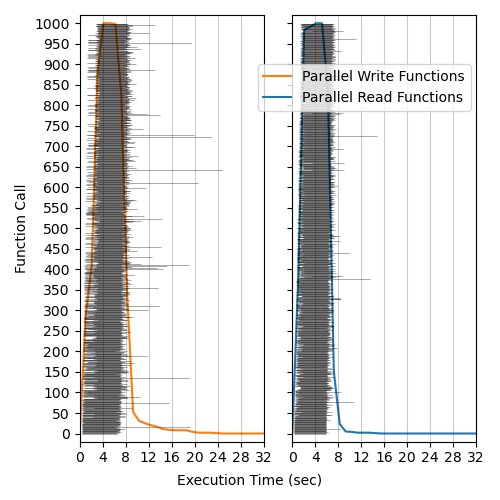
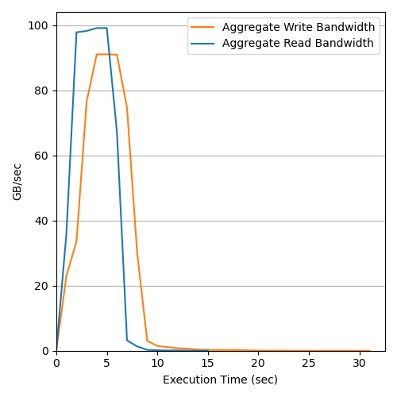
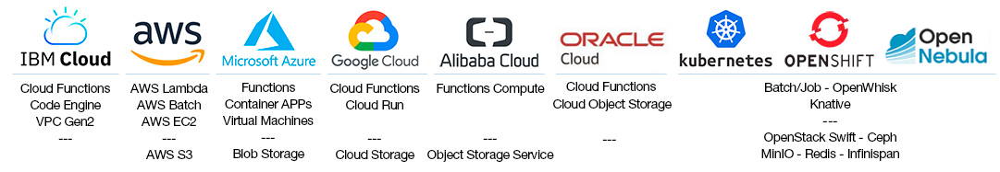

<p align="center">
  <a href="http://lithops.cloud">
    <h1 id='lithops' align="center"></h1>
  </a>
</p>

<p align="center">
  <a aria-label="License" href="https://github.com/lithops-cloud/lithops/blob/master/LICENSE">
    
  </a>
  <a aria-label="PyPi" href="https://pypi.org/project/lithops/">
    
  </a>
  <a aria-label="Python" href="#lithops">
    
  </a>
</p>

Lithops is a Python multi-cloud distributed computing framework. 
It allows you to run unmodified local python code at massive scale in the main serverless computing platforms. 
Lithops delivers the user’s code into the cloud without requiring knowledge of how it is deployed and run. 
Moreover, its multicloud-agnostic architecture ensures portability across cloud providers and on-premise deployments. 
In particular, Lithops offers compute and storage backends for most public Clouds (AWS, Google, Azure, IBM, Oracle, 
Alibaba), HPC Supercomputers (LithopsHPC), and on-premise deployments (OpenShift, OpenNebula, k8s).

Lithops is well suited for highly-parallel programs (parallel map) with little or no need for communication between 
processes (i.e. Monte Carlo simulations). However, Lithops is especially useful for parallel data processing 
where many functions read or write in parallel from Object Storage. As we can see in the following plot, 
Lithops can obtain an aggregate bandwidth of 100GB/s when 1000 Lambda functions read in parallel from S3. 
This is extremely useful for many <a href="https://github.com/iAmJK44/serverless_pipelines">scientific data analytics pipelines </a>(genomics, metabolomics, astronomics, climate science, geospatial)  that process unstructured or semi-structured data from Object Storage.

In Lithops, we can prioritize performance or cost depending on our requirements. If users require high performance and low startup times,
they can use Serverless Function backends like AWS Lambda which can launch hundred of functions in milliseconds.
Nevertheless, if the user prioritizes cost versus speed  in batch analytics, it could also run the same code
in AWS Batch over Spot instances at a fraction of the cost.


<p align="center">
  </img>
  </img>
</p>


## Installation

1. Install Lithops from the PyPi repository:

    ```bash
    pip install lithops
    ```

2. Execute a *Hello World* function:
  
   ```bash
   lithops hello
   ```

## Configuration
Lithops provides an extensible backend architecture (compute, storage) that is designed to work with different 
Cloud providers and on-premise backends. In this sense, you can code in python and run it unmodified in 
IBM Cloud, AWS, Azure, Google Cloud, Oracle, Aliyun and on-premise deployments with Kubernetes, OpenNebula or OpenShift.

[Follow these instructions to configure your compute and storage backends](config/)

<p align="center">
<a href="config/README.md#compute-and-storage-backends">

</a>
</p>


## High-level API

Lithops is shipped with 2 different high-level Compute APIs, and 2 high-level Storage APIs. However, the more commonly 
used APIS are the Future API and the Storage API (used together in most cases). The Storage OS API intercepts Python file access to interact with Object Storage.
The Lithops Multiprocessing API intercepts Python standard Multiprocessing API to invoke processes in Functions/containers and to 
communicate them (Pipe, Queue, manager) using REDIS. Storage OS API and Multiprocessing API has been mainly used to port unmodified Python code to the Cloud. 

In general, Lithops follows a simple parallel map API to apply a function to each item in an iterable (like a list) 
in parallel, utilizing multiple processors to speed up the computation.  This is useful in embarrassingly 
parallel tasks that can be executed independently and simultaneously. Most Lithops pipelines use the Future APIs to launch different
independent stages that read and write data to Object Storage.


<div align="center">
<table>
<tr>
  <th>
    
    <p><small><a href="docs/api_futures.md">Futures API</a></small></p>
  </th>
  <th>
    
    <p><small><a href="docs/source/api_multiprocessing.rst">Multiprocessing API</a></small></p>
  </th>
</tr>

<tr>
<td>

```python
from lithops import FunctionExecutor

def double(i):
    return i * 2

with FunctionExecutor() as fexec:
    f = fexec.map(double, [1,2,3,4,5,6])
    print(f.result())
```
</td>
<td>

```python
from lithops.multiprocessing import Pool

def double(i):
    return i * 2

with Pool() as pool:
    result = pool.map(double, [1, 2, 3, 4])
    print(result)
```
</td>
</tr>

</table>

<table>
<tr>
  <th>
    
    <p><small><a href="docs/api_storage.md">Storage API</a></small></p>
  </th>
  <th>
    
    <p><small><a href="docs/source/api_storage_os.rst">Storage OS API</a></small></p>
  </th>
</tr>

<tr>
<td>

```python
from lithops import Storage

if __name__ == "__main__":
    st = Storage()
    st.put_object(bucket='mybucket',
                  key='test.txt',
                  body='Hello World')

    print(st.get_object(bucket='lithops',
                        key='test.txt'))
```
</td>
<td>

```python
from lithops.storage.cloud_proxy import os

if __name__ == "__main__":
    filepath = 'bar/foo.txt'
    with os.open(filepath, 'w') as f:
        f.write('Hello world!')

    dirname = os.path.dirname(filepath)
    print(os.listdir(dirname))
    os.remove(filepath)
```
</td>
</tr>

</table>
</div>

You can find more usage examples in the [examples](/examples) folder.

## Elastic Data processing and Cloud optimized formats

Lithops is especially useful for parallel data processing.  If the pool.map function, instead of a list,
it uses a storage bucket, lithops will launch functions in parallel to process all data in that bucket. 
It will run one function per file, or it will even partition big files and give chunks to each function.

Lithops is ideally suited for processing Cloud Optimized data formats like ZARR, COG, COPC, or FlatGeoBuf  among others.
Cloud Optimized data is designed to enable on-the-fly partitioning and chunking that leverage Object Storage HTTP RANGE 
primitives. Such mechanism is essential for fast parallel data processing that benefits from the huge aggregate bandwidth 
obtained from concurrent functions reading from Object Storage.

Furthermore, thanks to the <a href="https://github.com/CLOUDLAB-URV/dataplug"> DATAPLUG library</a>, Lithops can also provide on-the-fly partitioning for 
other non Cloud optimized data formats like FASTA, FASTQ, FASTQGZIP (genomics), mlMZ (metabolomics) and LIDAR (geospatial).
For example, in the following code, we can see how Dataplug enables us to create a CloudObject from a LIDAR file in S3.
Dataplug is then used to establish the on-the-fly dynamic partitions for the CloudObject (slices). And finally, Lithops can 
process the file in parallel from Object Storage just by passing the slices iterator to the map function. 


```python
from dataplug import CloudObject
from dataplug.formats.geospatial.copc import CloudOptimizedPointCloud, square_split_strategy

# Function to process each LiDAR slice
def process_lidar_slice(data_slice):
    las_data = data_slice.get()
    lidar_file = laspy.open(las_data)
    ...
    
 co = CloudObject.from_s3(
        CloudOptimizedPointCloud,
        "s3://geospatial/copc/CA_YosemiteNP_2019/USGS_LPC_CA_YosemiteNP_2019_D19_11SKB6892.laz",
        s3_config=local_minio,
    )

    # Partition the point cloud into chunks
    slices = co.partition(square_split_strategy, num_chunks=9)

    # Process each slice in parallel using Lithops
    with lithops.FunctionExecutor() as executor:
        futures = executor.map(process_lidar_slice, slices)
        results = executor.get_result(futures)
```


# Success stories 

* <a href="https://metaspace2020.eu/">Metaspace Metabolomics Platform </a> is running in production in AWS with hundreds of users.
 MetaSpace is using Lithops over Lambda Functions and EC2 VMs to access metabolomics data in Amazon S3. MetaSpace moved from Spark to 
 Lithops to simplify dynamic and elastic resource provisioning. 
* <a href="https://opennebula.io/" >OpenNebula Open Source Cloud and Edge Computing platform </a> integrates Lithops as an easy to use appliance
  for data analytics. OpenNebula also deploys minio storage and Lithops K8s backend to facilitate data analytics in on-premise and edge deployments. 
* <a href="https://github.com/cubed-dev/cubed/tree/main" > Cubed  </a> is a popular library for
  scalable multidimensional array processing with bounded memory. Cubed is a drop-in replacement for Dask's Array API. Cubed 
  integrates Lithops as fast compute backend enabling scalable array processing in the Cloud.  
* <a href="https://www.bsc.es/marenostrum/marenostrum-5"> BSC Marenostrum 5 SuperComputer </a>is a pre-exascale EuroHPC supercomputer with a peak computational power of 314PFlops. A new Lithops HPC compute backend has been created enabling large-scale computing reaching tens of thousands of concurrent functions. LithopsHPC is now being used in neardata.eu project for extreme data analytics of genomics pipelines.


## Documentation

For documentation on using Lithops, see [latest release documentation](https://lithops-cloud.github.io/docs/) or [current github docs](docs/user_guide.md).

If you are interested in contributing, see [CONTRIBUTING.md](./CONTRIBUTING.md).

## Additional resources

### Blogs and Talks
* [How to run Lithops over EC2 VMs using the new K8s backend](https://danielalecoll.medium.com/how-to-run-lithops-over-ec2-vms-using-the-new-k8s-backend-4b0a4377c4e9) 
* [Simplify the developer experience with OpenShift for Big Data processing by using Lithops framework](https://medium.com/@gvernik/simplify-the-developer-experience-with-openshift-for-big-data-processing-by-using-lithops-framework-d62a795b5e1c)
* [Speed-up your Python applications using Lithops and Serverless Cloud resources](https://itnext.io/speed-up-your-python-applications-using-lithops-and-serverless-cloud-resources-a64beb008bb5)
* [Serverless Without Constraints](https://www.ibm.com/cloud/blog/serverless-without-constraints)
* [Lithops, a Multi-cloud Serverless Programming Framework](https://itnext.io/lithops-a-multi-cloud-serverless-programming-framework-fd97f0d5e9e4)
* [CNCF Webinar - Toward Hybrid Cloud Serverless Transparency with Lithops Framework](https://www.youtube.com/watch?v=-uS-wi8CxBo)
* [Using Serverless to Run Your Python Code on 1000 Cores by Changing Two Lines of Code](https://www.ibm.com/cloud/blog/using-serverless-to-run-your-python-code-on-1000-cores-by-changing-two-lines-of-code)
* [Decoding dark molecular matter in spatial metabolomics with IBM Cloud Functions](https://www.ibm.com/cloud/blog/decoding-dark-molecular-matter-in-spatial-metabolomics-with-ibm-cloud-functions)
* [Your easy move to serverless computing and radically simplified data processing](https://www.slideshare.net/gvernik/your-easy-move-to-serverless-computing-and-radically-simplified-data-processing-238929020) Strata Data Conference, NY 2019. See video of Lithops usage [here](https://www.youtube.com/watch?v=EYa95KyYEtg&list=PLpR7f3Www9KCjYisaG7AMaR0C2GqLUh2G&index=3&t=0s) and the example of Monte Carlo [here](https://www.youtube.com/watch?v=vF5HI2q5VKw&list=PLpR7f3Www9KCjYisaG7AMaR0C2GqLUh2G&index=2&t=0s)
* [Speed up data pre-processing with Lithops in deep learning](https://developer.ibm.com/patterns/speed-up-data-pre-processing-with-pywren-in-deep-learning/)
* [Predicting the future with Monte Carlo simulations over IBM Cloud Functions](https://www.ibm.com/cloud/blog/monte-carlo-simulations-with-ibm-cloud-functions)
* [Process large data sets at massive scale with Lithops over IBM Cloud Functions](https://www.ibm.com/cloud/blog/process-large-data-sets-massive-scale-pywren-ibm-cloud-functions)
* [Industrial project in Technion on Lithops](http://www.cs.technion.ac.il/~cs234313/projects_sites/W19/04/site/)

### Papers

* [Serverful Functions: Leveraging Servers in Complex Serverless Workflows](https://dl.acm.org/doi/10.1145/3700824.3701095)  - ACM Middleware Industrial Track 2024 
* [Transparent serverless execution of Python multiprocessing applications](https://dl.acm.org/doi/10.1016/j.future.2022.10.038) - Elsevier Future Generation Computer Systems 2023
* [Outsourcing Data Processing Jobs with Lithops](https://ieeexplore.ieee.org/document/9619947) - IEEE Transactions on Cloud Computing 2022
* [Towards Multicloud Access Transparency in Serverless Computing](https://www.computer.org/csdl/magazine/so/5555/01/09218932/1nMMkpZ8Ko8) - IEEE Software 2021
* [Primula: a Practical Shuffle/Sort Operator for Serverless Computing](https://dl.acm.org/doi/10.1145/3429357.3430522) - ACM/IFIP International Middleware Conference 2020. [See presentation here](https://www.youtube.com/watch?v=v698iu5YfWM)
* [Bringing scaling transparency to Proteomics applications with serverless computing](https://dl.acm.org/doi/abs/10.1145/3429880.3430101) - 6th International Workshop on Serverless Computing (WoSC6) 2020. [See presentation here](https://www.serverlesscomputing.org/wosc6/#p10)
* [Serverless data analytics in the IBM Cloud](https://dl.acm.org/citation.cfm?id=3284029) - ACM/IFIP International Middleware Conference 2018


# Acknowledgements
This project has received funding from the European Union's Horizon 2020 research and innovation programme under grant agreement No 825184 (CloudButton).
