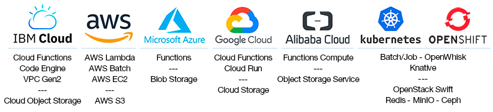

<p align="center">
  <a href="http://lithops.cloud">
    <h1 id='lithops' align="center"></h1>
  </a>
</p>

<p align="center">
  <a aria-label="License" href="https://github.com/lithops-cloud/lithops/blob/master/LICENSE">
    
  </a>
  <a aria-label="PyPi" href="https://pypi.org/project/lithops/">
    
  </a>
  <a aria-label="Python" href="#lithops">
    
  </a>
</p>

Lithops is a Python multi-cloud distributed computing framework. It allows you to run unmodified local python code at massive scale in the main
serverless computing platforms. Lithops delivers the user’s code into the cloud without requiring knowledge of how it is deployed and run. Moreover, its multicloud-agnostic architecture ensures portability across cloud providers.

Lithops is specially suited for highly-parallel programs with little or no need for communication between processes, but it also supports parallel applications that need to share state among processes. Examples of applications that run with Lithops include Monte Carlo simulations, deep learning and machine learning processes, metabolomics computations, and geospatial analytics, to name a few.


## Installation

1. Install Lithops from the PyPi repository:

    ```bash
    $ pip install lithops
    ```

2. Execute a *Hello World* test function:
  
   ```bash
   $ lithops test
   ```

## Configuration
Lithops provides an extensible backend architecture (compute, storage) that is designed to work with different Cloud providers and on-premise backends. In this sense, you can code in python and run it unmodified in IBM Cloud, AWS, Azure, Google Cloud, Aliyun and Kubernetes or OpenShift.

[Follow these instructions to configure your compute and storage backends](config/)

<p align="center">
<a href="config/README.md#compute-and-storage-backends">

</a>
</p>


## High-level API

Lithops is shipped with 2 different high-level Compute APIs, and 2 high-level Storage APIs


<table>
<tr>
<th align="center">

<p> 
<small>
<a href="docs/api_futures.md">Futures API</a>
</small>
</p>
</th>
<th align="center">

<p> 
<small>
<a href="docs/source/api_multiprocessing.rst">Multiprocessing API</a>
</small>
</p>
</th>
</tr>

<tr>
<td>

```python
from lithops import FunctionExecutor

def hello(name):
    return 'Hello {}!'.format(name)

with FunctionExecutor() as fexec:
    fut = fexec.call_async(hello, 'World')
    print(fut.result())
```
</td>
<td>

```python
from lithops.multiprocessing import Pool

def double(i):
    return i * 2

with Pool() as pool:
    result = pool.map(double, [1, 2, 3, 4, 5])
    print(result)
```
</td>
</tr>

</table>


<table>
<tr>
<th align="center">

<p> 
<small>
<a href="docs/api_storage.md">Storage API</a>
</small>
</p>
</th>
<th align="center">

<p> 
<small>
<a href="docs/source/api_storage_os.rst">Storage OS API</a>
</small>
</p>
</th>
</tr>

<tr>
<td>

```python
from lithops import Storage

if __name__ == "__main__":
    st = Storage()
    st.put_object(bucket='mybucket',
                  key='test.txt',
                  body='Hello World')

    print(st.get_object(bucket='mybucket',
                        key='test.txt'))
```
</td>
<td>

```python
from lithops.storage.cloud_proxy import os

if __name__ == "__main__":
    filepath = 'bar/foo.txt'
    with os.open(filepath, 'w') as f:
        f.write('Hello world!')

    dirname = os.path.dirname(filepath)
    print(os.listdir(dirname))
    os.remove(filepath)
```
</td>
</tr>

</table>

You can find more usage examples in the [examples](/examples) folder.

## Execution Modes

Lithops is shipped with 3 different modes of execution. The execution mode allows you to decide where and how the functions are executed.

<table>
<tr>
<th align="center">

<p> 
<small>
Localhost Mode
</small>
</p>
</th>
<th align="center">

<p> 
<small>
Serverless Mode
</small>
</p>
</th>
<th align="center">

<p> 
<small>
Standalone Mode
</small>
</p>
</th>
</tr>
<tr>
<td>

This mode allows you to run functions in your local machine, by using processes. This is the default mode of execution if no configuration is provided.

</td>
<td>

This mode allows you to run functions by using publicly accessible Serverless compute services, such as IBM Cloud Functions, Amazon Lambda or Google Cloud Functions, among others. In this mode of execution, each function invocation equals to a parallel task running in the cloud in an isolated environment.

</td>

<td>

This mode allows to run functions by using one or multiple Virtual machines (VM), either in a private cluster or in the cloud. In each VM, functions run using parallel processes like in the Localhost mode.

</td>
</tr>
</table>

## Documentation

For documentation on using Lithops, see [latest release documentation](https://lithops-cloud.github.io/docs/) or [current github docs](docs/user_guide.md).

If you are interested in contributing, see [CONTRIBUTING.md](./CONTRIBUTING.md).

## Additional resources

### Blogs and Talks
* [Simplify the developer experience with OpenShift for Big Data processing by using Lithops framework](https://medium.com/@gvernik/simplify-the-developer-experience-with-openshift-for-big-data-processing-by-using-lithops-framework-d62a795b5e1c)
* [Speed-up your Python applications using Lithops and Serverless Cloud resources](https://itnext.io/speed-up-your-python-applications-using-lithops-and-serverless-cloud-resources-a64beb008bb5)
* [Serverless Without Constraints](https://www.ibm.com/cloud/blog/serverless-without-constraints)
* [Lithops, a Multi-cloud Serverless Programming Framework](https://itnext.io/lithops-a-multi-cloud-serverless-programming-framework-fd97f0d5e9e4)
* [CNCF Webinar - Toward Hybrid Cloud Serverless Transparency with Lithops Framework](https://www.youtube.com/watch?v=-uS-wi8CxBo)
* [Using Serverless to Run Your Python Code on 1000 Cores by Changing Two Lines of Code](https://www.ibm.com/cloud/blog/using-serverless-to-run-your-python-code-on-1000-cores-by-changing-two-lines-of-code)
* [Decoding dark molecular matter in spatial metabolomics with IBM Cloud Functions](https://www.ibm.com/cloud/blog/decoding-dark-molecular-matter-in-spatial-metabolomics-with-ibm-cloud-functions)
* [Your easy move to serverless computing and radically simplified data processing](https://www.slideshare.net/gvernik/your-easy-move-to-serverless-computing-and-radically-simplified-data-processing-238929020) Strata Data Conference, NY 2019
  * See video of Lithops usage [here](https://www.youtube.com/watch?v=EYa95KyYEtg&list=PLpR7f3Www9KCjYisaG7AMaR0C2GqLUh2G&index=3&t=0s) and the example of Monte Carlo [here](https://www.youtube.com/watch?v=vF5HI2q5VKw&list=PLpR7f3Www9KCjYisaG7AMaR0C2GqLUh2G&index=2&t=0s)
* [Speed up data pre-processing with Lithops in deep learning](https://developer.ibm.com/patterns/speed-up-data-pre-processing-with-pywren-in-deep-learning/)
* [Predicting the future with Monte Carlo simulations over IBM Cloud Functions](https://www.ibm.com/cloud/blog/monte-carlo-simulations-with-ibm-cloud-functions)
* [Process large data sets at massive scale with Lithops over IBM Cloud Functions](https://www.ibm.com/cloud/blog/process-large-data-sets-massive-scale-pywren-ibm-cloud-functions)
* [Industrial project in Technion on Lithops](http://www.cs.technion.ac.il/~cs234313/projects_sites/W19/04/site/)

### Papers
* [Towards Multicloud Access Transparency in Serverless Computing](https://www.computer.org/csdl/magazine/so/5555/01/09218932/1nMMkpZ8Ko8) - IEEE Software 2021
* [Primula: a Practical Shuffle/Sort Operator for Serverless Computing](https://dl.acm.org/doi/10.1145/3429357.3430522) - ACM/IFIP International Middleware Conference 2020. [See presentation here](https://www.youtube.com/watch?v=v698iu5YfWM)
* [Bringing scaling transparency to Proteomics applications with serverless computing](https://dl.acm.org/doi/abs/10.1145/3429880.3430101) - 6th International Workshop on Serverless Computing (WoSC6) 2020. [See presentation here](https://www.serverlesscomputing.org/wosc6/#p10)
* [Serverless data analytics in the IBM Cloud](https://dl.acm.org/citation.cfm?id=3284029) - ACM/IFIP International Middleware Conference 2018


# Acknowledgements


This project has received funding from the European Union's Horizon 2020 research and innovation programme under grant agreement No 825184.

