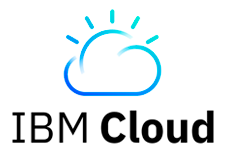
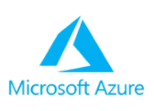
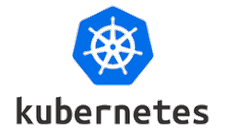

<p align="center">
  <a href="http://lithops.cloud">
    <h1 id='lithops' align="center"></h1>
  </a>
</p>

<p align="center">
  <a aria-label="License" href="https://github.com/lithops-cloud/lithops/blob/master/LICENSE"></a>&nbsp<a aria-label="PyPI" href="https://pypi.org/project/lithops/"></a>&nbsp<a aria-label="Python" href="#lithops"></a>&nbsp<a href="https://pypistats.org/packages/lithops"></a>&nbsp<a href="https://deepwiki.com/lithops-cloud/lithops" target="_blank" rel="noopener"></a>
</p>

Lithops is a Python multi-cloud distributed computing framework that lets you run unmodified Python code at massive scale across cloud, HPC, and on-premise platforms. It supports major cloud providers and Kubernetes platforms, running your code transparently without requiring you to manage deployment or infrastructure.

Lithops is ideal for highly parallel workloads—such as Monte Carlo simulations, machine learning, metabolomics, or geospatial analytics—and lets you tailor execution to your priorities: you can optimize for performance using AWS Lambda to launch hundreds of functions in milliseconds, or reduce costs by running the same code on AWS Batch with Spot Instances.

## Installation

1. Install Lithops from the PyPI repository:

    ```bash
    pip install lithops
    ```

2. Execute a *Hello World* function:
  
   ```bash
   lithops hello
   ```

## Configuration

Lithops provides an extensible backend architecture for compute and storage, designed to work with various cloud providers and on-premise platforms. You can write your code in Python and run it unmodified across major cloud providers and Kubernetes environments.

[Follow these instructions to configure your compute and storage backends](config/)

Supported backends by platform:

<p align="center">
<table>
<tr>
  <th align="center">Platform</th>
  <th align="center">Compute</th>
  <th align="center">Storage</th>
</tr>
<tr>
  <td align="center" valign="top">
    <br/>
    <strong>Localhost</strong>
  </td>
  <td align="left" valign="top"><a href="docs/source/compute_config/localhost.md">Localhost</a></td>
  <td align="left" valign="top"><a href="docs/source/compute_config/localhost.md">Localhost</a></td>
</tr>
<tr>
  <td align="center" valign="top">
    
  </td>
  <td align="left" valign="top">
    <a href="docs/source/compute_config/code_engine.md">IBM Code Engine</a><br/>
    <a href="docs/source/compute_config/ibm_vpc.md">IBM Virtual Private Cloud</a>
  </td>
  <td align="left" valign="top">
    <a href="docs/source/storage_config/ibm_cos.md">IBM Cloud Object Storage</a>
  </td>
</tr>
<tr>
  <td align="center" valign="top">
    
  </td>
  <td align="left" valign="top">
    <a href="docs/source/compute_config/aws_lambda.md">AWS Lambda</a><br/>
    <a href="docs/source/compute_config/aws_batch.md">AWS Batch</a><br/>
    <a href="docs/source/compute_config/aws_ec2.md">AWS Elastic Compute Cloud (EC2)</a>
  </td>
  <td align="left" valign="top">
    <a href="docs/source/storage_config/aws_s3.md">AWS S3</a>
  </td>
</tr>
<tr>
  <td align="center" valign="top">
    
  </td>
  <td align="left" valign="top">
    <a href="docs/source/compute_config/gcp_functions.md">Google Cloud Run functions</a><br/>
    <a href="docs/source/compute_config/gcp_cloudrun.md">Google Cloud Run</a><br/>
    <a href="docs/source/compute_config/gcp_compute_engine.md">Google Compute Engine</a>
  </td>
  <td align="left" valign="top">
    <a href="docs/source/storage_config/gcp_storage.md">Google Cloud Storage</a>
  </td>
</tr>
<tr>
  <td align="center" valign="top">
    
  </td>
  <td align="left" valign="top">
    <a href="docs/source/compute_config/azure_functions.md">Azure Functions</a><br/>
    <a href="docs/source/compute_config/azure_containers.md">Azure Container Apps</a><br/>
    <a href="docs/source/compute_config/azure_vms.md">Azure Virtual Machines</a>
  </td>
  <td align="left" valign="top">
    <a href="docs/source/storage_config/azure_blob.md">Azure Blob Storage</a>
  </td>
</tr>
<tr>
  <td align="center" valign="top">
    
  </td>
  <td align="left" valign="top">
    <a href="docs/source/compute_config/aliyun_functions.md">Aliyun Functions Compute</a>
  </td>
  <td align="left" valign="top">
    <a href="docs/source/storage_config/aliyun_oss.md">Aliyun Object Storage Service</a>
  </td>
</tr>
<tr>
  <td align="center" valign="top">
    
  </td>
  <td align="left" valign="top">
    <a href="docs/source/compute_config/oracle_functions.md">Oracle Functions</a>
  </td>
  <td align="left" valign="top">
    <a href="docs/source/storage_config/oracle_oss.md">Oracle Object Storage</a>
  </td>
</tr>
<tr>
  <td align="center" valign="top">
    <br/>
    
  </td>
  <td align="left" valign="top">
    <a href="docs/source/compute_config/kubernetes.md">Kubernetes Jobs</a><br/>
    <a href="docs/source/compute_config/knative.md">Knative</a><br/>
    <a href="docs/source/compute_config/singularity.md">Singularity</a><br/>
    <a href="docs/source/compute_config/openwhisk.md">OpenWhisk</a><br/>
    <a href="docs/source/compute_config/vm.md">Virtual Machine</a>
  </td>
  <td align="left" valign="top">
    <a href="docs/source/storage_config/swift.md">OpenStack Swift</a><br/>
    <a href="docs/source/storage_config/redis.md">Redis</a><br/>
    <a href="docs/source/storage_config/ceph.md">Ceph</a><br/>
    <a href="docs/source/storage_config/minio.md">MinIO</a><br/>
    <a href="docs/source/storage_config/infinispan.md">Infinispan</a>
  </td>
</tr>
</table>
</p>


## High-level API

Lithops provides two high-level compute APIs and two high-level storage APIs.

### [Futures API](docs/source/api_futures.rst)

```python
from lithops import FunctionExecutor

def double(i):
    return i * 2

with FunctionExecutor() as fexec:
    f = fexec.map(double, [1, 2, 3, 4])
    print(f.result())
```

### [Multiprocessing API](docs/source/api_multiprocessing.rst)

```python
from lithops.multiprocessing import Pool

def double(i):
    return i * 2

with Pool() as pool:
    result = pool.map(double, [1, 2, 3, 4])
    print(result)
```

### [Storage API](docs/source/api_storage.rst)

```python
from lithops import Storage

if __name__ == "__main__":
    st = Storage()
    st.put_object(bucket='mybucket', key='test.txt', body='Hello World')
    print(st.get_object(bucket='mybucket', key='test.txt'))
```

### [Storage OS API](docs/source/api_storage_os.rst)

```python
from lithops.storage.cloud_proxy import os

if __name__ == "__main__":
    filepath = 'bar/foo.txt'
    with os.open(filepath, 'w') as f:
        f.write('Hello world!')

    dirname = os.path.dirname(filepath)
    print(os.listdir(dirname))
    os.remove(filepath)
```

You can find more usage examples in the [examples](/examples) folder.

## Documentation

For documentation on using Lithops, see the [latest release documentation](https://lithops-cloud.github.io/docs/).

If you are interested in contributing, see [CONTRIBUTING.md](./CONTRIBUTING.md).

## Additional resources

### Blogs and Talks

* [How to run Lithops over EC2 VMs using the new K8s backend](https://danielalecoll.medium.com/how-to-run-lithops-over-ec2-vms-using-the-new-k8s-backend-4b0a4377c4e9) 
* [Simplify the developer experience with OpenShift for Big Data processing by using Lithops framework](https://medium.com/@gvernik/simplify-the-developer-experience-with-openshift-for-big-data-processing-by-using-lithops-framework-d62a795b5e1c)
* [Speed-up your Python applications using Lithops and Serverless Cloud resources](https://itnext.io/speed-up-your-python-applications-using-lithops-and-serverless-cloud-resources-a64beb008bb5)
* [Lithops, a Multi-cloud Serverless Programming Framework](https://itnext.io/lithops-a-multi-cloud-serverless-programming-framework-fd97f0d5e9e4)
* [CNCF Webinar - Toward Hybrid Cloud Serverless Transparency with Lithops Framework](https://www.youtube.com/watch?v=-uS-wi8CxBo)
* [Your easy move to serverless computing and radically simplified data processing](https://www.slideshare.net/gvernik/your-easy-move-to-serverless-computing-and-radically-simplified-data-processing-238929020) — Strata Data Conference, NY 2019. See a video of Lithops usage [here](https://www.youtube.com/watch?v=EYa95KyYEtg&list=PLpR7f3Www9KCjYisaG7AMaR0C2GqLUh2G&index=3&t=0s) and a Monte Carlo example [here](https://www.youtube.com/watch?v=vF5HI2q5VKw&list=PLpR7f3Www9KCjYisaG7AMaR0C2GqLUh2G&index=2&t=0s)

<!---
* [Serverless Without Constraints](https://www.ibm.com/cloud/blog/serverless-without-constraints)
* [Using Serverless to Run Your Python Code on 1000 Cores by Changing Two Lines of Code](https://www.ibm.com/cloud/blog/using-serverless-to-run-your-python-code-on-1000-cores-by-changing-two-lines-of-code)
* [Decoding dark molecular matter in spatial metabolomics with IBM Cloud Functions](https://www.ibm.com/cloud/blog/decoding-dark-molecular-matter-in-spatial-metabolomics-with-ibm-cloud-functions)
* [Speed up data pre-processing with Lithops in deep learning](https://developer.ibm.com/patterns/speed-up-data-pre-processing-with-pywren-in-deep-learning/)
* [Predicting the future with Monte Carlo simulations over IBM Cloud Functions](https://www.ibm.com/cloud/blog/monte-carlo-simulations-with-ibm-cloud-functions)
* [Process large data sets at massive scale with Lithops over IBM Cloud Functions](https://www.ibm.com/cloud/blog/process-large-data-sets-massive-scale-pywren-ibm-cloud-functions)
* [Industrial project in Technion on Lithops](http://www.cs.technion.ac.il/~cs234313/projects_sites/W19/04/site/)
-->

### Papers
* [Serverful Functions: Leveraging Servers in Complex Serverless Workflows](https://dl.acm.org/doi/10.1145/3700824.3701095) - ACM Middleware Industrial Track 2024
* [Transparent serverless execution of Python multiprocessing applications](https://dl.acm.org/doi/10.1016/j.future.2022.10.038) - Elsevier Future Generation Computer Systems 2023
* [Outsourcing Data Processing Jobs with Lithops](https://ieeexplore.ieee.org/document/9619947) - IEEE Transactions on Cloud Computing 2022
* [Towards Multicloud Access Transparency in Serverless Computing](https://www.computer.org/csdl/magazine/so/5555/01/09218932/1nMMkpZ8Ko8) - IEEE Software 2021
* [Primula: a Practical Shuffle/Sort Operator for Serverless Computing](https://dl.acm.org/doi/10.1145/3429357.3430522) - ACM/IFIP International Middleware Conference 2020. [See presentation here](https://www.youtube.com/watch?v=v698iu5YfWM)
* [Bringing scaling transparency to Proteomics applications with serverless computing](https://dl.acm.org/doi/abs/10.1145/3429880.3430101) - 6th International Workshop on Serverless Computing (WoSC6) 2020. [See presentation here](https://www.serverlesscomputing.org/wosc6/#p10)
* [Serverless data analytics in the IBM Cloud](https://dl.acm.org/citation.cfm?id=3284029) - ACM/IFIP International Middleware Conference 2018


# Acknowledgements

This project has received funding from the European Union's Horizon 2020 research and innovation programme under grant agreement No. 825184 (CloudButton).
