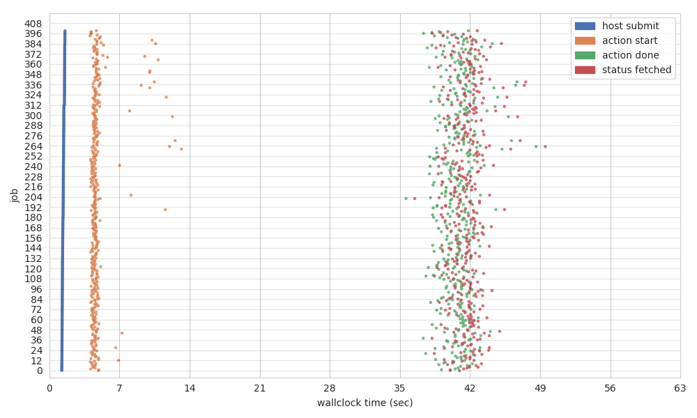
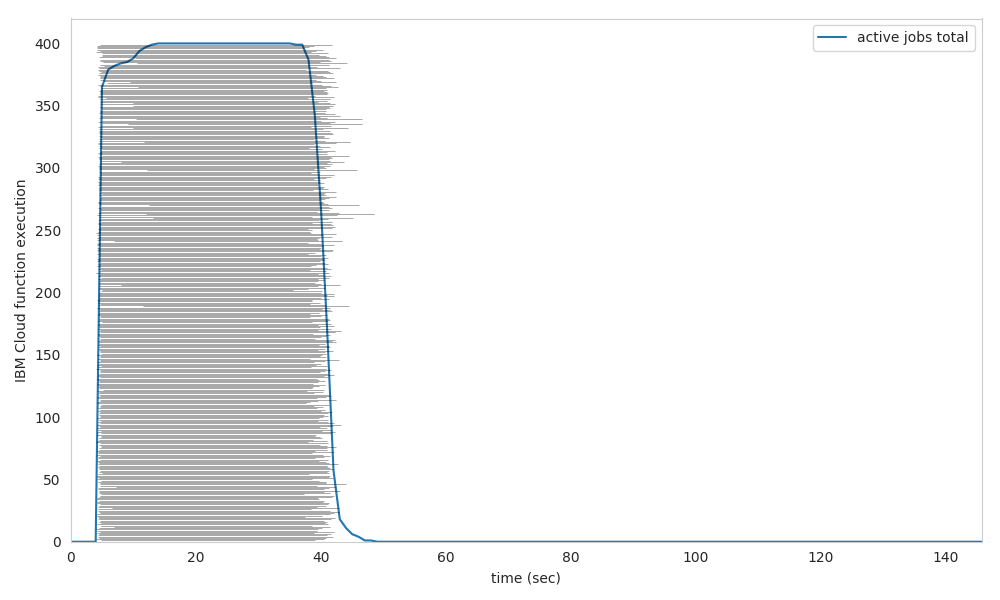

# Lithops Futures API Details

## Executor
The primary object in Lithops is the executor. The standard way to get everything set up is to import `lithops`, and create an instance of one of the available modes of executions.

Lithops is shipped with 3 modes of execution: **Localhost**, **Serverless** and **Standalone**. In this sense, each mode of execution has its own executor class:

* `lithops.LocalhostExecutor()`: Executor that uses local processes to run jobs in the local machine.
* `lithops.ServerlessExecutor()`: Executor to run jobs in one of the available serverless compute backends.
* `lithops.StandaloneExecutor()`: Executor to run jobs in one of the available standalone compute backends.

Additionally, Lithops includes a top-level function executor, which encompasses all three previous executors:

* `lithops.FunctionExecutor()`: Generic executor that will use the configuration to determine its mode of execution, i.e., based on the configuration it will be **localhost**, **serverless** or **standalone**.


By default, the executor load the configuration from the config file. Alternatively, you can pass the configuration with a python dictionary. In any case, note that all the parameters set in the executor will overwrite those set in the configuration.


The available calls within an executor are:

|API Call| Type | Description|
|---|---|---|
|[call_async()](api_futures.md#executorcall_async) | Async. | Method used to spawn one function activation |
|[map()](api_futures.md#executormap) | Async. | Method used to spawn multiple function activations |
|[map_reduce()](api_futures.md#executormap_reduce) | Async. | Method used to spawn multiple function activations with one (or multiple) reducers|
|[wait()](api_futures.md#executorwait) | Sync. | Wait for the function activations to complete. It blocks the local execution until all the function activations finished their execution (configurable)|
|[get_result()](api_futures.md#executorget_result) | Sync. | Method used to retrieve the results of all function activations. The results are returned within an ordered list, where each element of the list is the result of one activation|
|[plot()](api_futures.md#executorplot) | Sync. | Method used to create execution plots |
|[job_summary()](api_futures.md#jobsummary) | Sync. | Method used to create a summary file of the executed jobs. It includes times and money |
|[clean()](api_futures.md#executorclean) | Async. | Method used to clean the temporary data generated by Lithops|


**LocalhostExecutor(\*\*kwargs)**

Initialize and return Localhost executor object.

|Parameter | Default | Description|
|---|---|---|
|config | None | Settings passed in here will override those in lithops_config|
|runtime |  None | Name of the docker image to run the functions |
|workers | cpu_count | Max number of parallel workers |
|storage | localhost | Storage backend to store temp data|
|monitoring | storage | Monitoring system implementation. One of: storage, rabbitmq |
|log_level | INFO | Log level printing (INFO, DEBUG, ...). Set it to None to hide all logs. If this is param is set, all logging params in config are disabled|

Usage:

```python
import lithops
fexec = lithops.LocalhostExecutor()
```

**ServerlessExecutor(\*\*kwargs)**

Initialize and return a Serverless executor object.

|Parameter | Default | Description|
|---|---|---|
|config | None | Settings passed in here will override those in lithops_config|
|backend | ibm_cf | Serverless compute backend to run the functions|
|runtime |  None | Name of the docker image to run the functions |
|runtime_memory | 256 | Memory (in MB) to use to run the functions |
|storage | ibm_cos | Storage backend to store temp data|
|workers | *depends of the backend* | Max number of parallel workers |
|monitoring | storage | Monitoring system implementation. One of: storage, rabbitmq |
|remote_invoker | False | Spawn a function that will perform the actual job invocation (True/False) |
|log_level | INFO | Log level printing (INFO, DEBUG, ...). Set it to None to hide all logs. If this is param is set, all logging params in config are disabled|

Usage:

```python
import lithops
fexec = lithops.ServerlessExecutor()
```

**StandaloneExecutor(\*\*kwargs)**

Initialize and return an Standalone executor object.

|Parameter | Default | Description|
|---|---|---|
|config | None | Settings passed in here will override those in lithops_config|
|backend | ibm_vpc | Standalone compute backend to run the functions|
|runtime |  python3 | Name of the runtime to run the functions. It can be a docker image or *python3* |
|workers | cpu_count | Max number of parallel workers |
|storage | ibm_cos | Storage backend to store temp data|
|monitoring | storage | Monitoring system implementation. One of: storage, rabbitmq |
|log_level | INFO | Log level printing (INFO, DEBUG, ...). Set it to None to hide all logs. If this is param is set, all logging params in config are disabled|

Usage:

```python
import lithops
fexec = lithops.StandaloneExecutor()
```

**FunctionExecutor(\*\*kwargs)**

Initialize and return a generic function executor.

|Parameter | Default | Description|
|---|---|---|
|mode | serverless | Execution mode. One of: localhost, serverless or standalone|
|config | None | Settings passed in here will override those in lithops_config|
|backend | None | Compute backend to run the functions|
|runtime |  None | Name of the runtime to run the functions. |
|runtime_memory | None | Memory (in MB) to use to run the functions |
|workers | None | Max number of parallel workers |
|storage | ibm_cos | Storage backend to store temp data|
|monitoring | storage | Monitoring system implementation. One of: storage, rabbitmq |
|remote_invoker | False | Spawn a function that will perform the actual job invocation (True/False) |
|log_level | INFO | Log level printing (INFO, DEBUG, ...). Set it to None to hide all logs. If this is param is set, all logging params in config are disabled|

Usage:

```python
import lithops
fexec = lithops.FunctionExecutor()
```


## Executor.call_async()

Spawn only one function activation.

**call_async**(func, data, \*\*kwargs)

|Parameter | Default |Description|
|---|---|---|
|func | |The function to map over the data |
|data |  |A single value of data |
|extra_env| None |Additional environment variables for CF environment|
|runtime_memory| 256 |Memory (in MB) to use to run the functions|
|timeout| 600 |Max time per function activation (seconds)|
|include_modules| [] |Explicitly pickle these dependencies. All required dependencies are pickled if default empty list. No one dependency is pickled if it is explicitly set to None |
|exclude_modules| [] |Explicitly keep these modules from pickled dependencies. It is not taken into account if you set include_modules |

* **Returns**: One future for each job (Futures are also internally stored by Lithops).

* **Usage**:

    ```python
    future = fexec.call_async(foo, data)
    ```

* **Code example**: [call_async.py](../examples/call_async.py)

## Executor.map()

Spawn multiple function activations based on the items of an input list.

**map**(map_function, map_iterdata, \*\*kwargs)

|Parameter| Default |Description|
|---|---|---|
|map_function | |The function to map over the data |
|map_iterdata |  |An iterable of input data (e.g python list) |
|chunksize | 1 | Split map_iteradata in chunks of this size. Lithops spawns 1 worker per resulting chunk |
|worker_processes | 1 | Number of concurrent/parallel processes in each worker|
|extra_args|  None | Additional arguments to pass to each map_function activation |
|extra_env| None |Additional environment variables for CF environment |
|runtime_memory| 256 |Memory (in MB) to use to run the functions |
|timeout| 600 |Max time per function activation (seconds) |
|include_modules| [] |Explicitly pickle these dependencies. All required dependencies are pickled if default empty list. No one dependency is pickled if it is explicitly set to None |
|exclude_modules| [] |Explicitly keep these modules from pickled dependencies. It is not taken into account if you set include_modules |
|obj_chunk_size| None | Used for data_processing. Chunk size to split each object in bytes. Must be >= 1MiB. 'None' for processing the whole file in one function activation|
|obj_chunk_number| None | Used for data_processing. Number of chunks to split each object. 'None' for processing the whole file in one function activation. chunk_n has prevalence over chunk_size if both parameters are set|
|obj_newline| '\n' | New line character for keeping line integrity of partitions. 'None' for disabling line integrity logic and get partitions of the exact same size in the functions|

* **Returns**: A list with size  len(map_iterdata) of futures for each job (Futures are also internally stored by Lithops).

* **Usage**:

    ```python
    iterdata = [1, 2, 3, 4]
    futures = fexec.map(foo, iterdata)
    ```

* **Code example**: [map.py](../examples/map.py)

## Executor.map_reduce()

Spawn multiple *map_function* activations,  based on the items of an input list,  eventually spawning one (or multiple) *reduce_function* activations over the results of the map phase.

**map_reduce**(map_function, map_iterdata, reduce_function, \*\*kwargs)

|Parameter| Default |Description|
|---|---|---|
|map_function| |The function to map over the data |
|map_iterdata |  |An iterable of input data (e.g python list)|
|chunksize | 1 | Split map_iteradata in chunks of this size. Lithops spawns 1 worker per resulting chunk |
|worker_processes | 1 | Number of concurrent/parallel processes in each worker|
|extra_args|  None | Additional arguments to pass to each map_function activation |
|reduce_function|  |The function to map over the results of map_function |
|spawn_reducer| 20 | Percentage of done map functions before spawning the reduce function. By default the reducer is spawned when 20% of the map activations are done. |
|extra_env| None | Additional environment variables for CF environment|
|map_runtime_memory| 256 | Memory (in MB) to use to run the map_function|
|reduce_runtime_memory| 256| Memory (in MB) to use to run the reduce_function|
|timeout| 600 | Max time per function activation (seconds)|
|include_modules| [] |Explicitly pickle these dependencies. All required dependencies are pickled if default empty list. No one dependency is pickled if it is explicitly set to None |
|exclude_modules| [] |Explicitly keep these modules from pickled dependencies. It is not taken into account if you set include_modules |
|obj_chunk_size| None | Used for data_processing. Chunk size to split each object in bytes. Must be >= 1MiB. 'None' for processing the whole file in one function activation|
|obj_chunk_number| None | Used for data_processing. Number of chunks to split each object. 'None' for processing the whole file in one function activation. chunk_n has prevalence over chunk_size if both parameters are set|
|obj_newline| '\n' | New line character for keeping line integrity of partitions. 'None' for disabling line integrity logic and get partitions of the exact same size in the functions|
|obj_reduce_by_key| False| Used for data_processing. Set one reducer per object after running the partitioner (reduce-by-key) |


* **Returns**: A list with size  len(map_iterdata)  of futures for each job (Futures are also internally stored by Lithops).

* **Usage**:

    ```python
    iterdata = [1, 2, 3, 4]
    futures = fexec.map_reduce(foo, iterdata, bar)
    ```

* **Code example**: [map_reduce.py](../examples/map_reduce.py)


## Executor.wait()

Waits for the function activations to finish.

**wait**(\*\*kwargs)

|Parameter| Default |Description|
|---|---|---|
|fs| None | List of futures to wait. If None, Lithops uses the internally stored futures |
|throw_except | True | Re-raise exception if call raised|
|return_when| ALL_COMPLETED | One of 'ALL_COMPLETED', 'ANY_COMPLETED', 'ALWAYS' |
|download_results| False | Whether or not download the results while monitoring activations |
|timeout| None | Timeout of waiting for results (in seconds)|
|THREADPOOL_SIZE|  128 | Number of threads to use waiting for results|
|WAIT_DUR_SEC| 1 |  Time interval between each check (seconds) if no rabbitmq_monitor activated |
|show_progressbar| True | whether or not to show the progress bar |


* **Returns**: `(fs_done, fs_notdone)` where `fs_done` is a list of futures that have completed and `fs_notdone` is a list of futures that have not completed.

* **Usage**:

    ```python
    iterdata = [1, 2, 3, 4]
    futures = fexec.map(foo, iterdata)
    fexec.wait()
    ```

* **Code example**: [wait.py](../examples/wait.py)

## Executor.get_result()

Gets the results from all the function activations. It internally makes use of the `Executor.wait()` method.

**get_result**(\*\*kwargs)

|Parameter| Default |Description|
|---|---|---|
|fs| None | List of futures to get the results. If None, Lithops uses the internally stored futures |
|throw_except | True | Re-raise exception if call raised|
|timeout| None | Timeout of waiting for results (in seconds)|
|THREADPOOL_SIZE|  128 | Number of threads to use waiting for results|
|WAIT_DUR_SEC| 1 |  Time interval between each check (seconds) if no rabbitmq_monitor activated |
|show_progressbar| True | whether or not to show the progress bar |

* **Returns**: The results are returned within an ordered list, where each element of the list is the result of one activation. 

* **Usage**:

    ```python
    iterdata = [1, 2, 3, 4]
    futures = fexec.map(foo, iterdata)
    results = fexec.get_result()
    ```

* **Code example**: [call_async.py](../examples/call_async.py), [map.py](../examples/map.py), [map_reduce.py](../examples/map_reduce.py)

## Executor.plot()

Creates 2 detailed execution plots: A timeline plot and a histogram plot.

**plot**(\*\*kwargs)

|Parameter| Default |Description|
|---|---|---|
|fs| None | List of futures to plot. If None, Lithops uses the internally stored futures|
|dst| None  | Path to destination file, either absolute or relative. If set, you must specify the path + the file prefix (see example below), then lithops will generate the *prefix*_histogram.png and *prefix*_timeline.png files. If None, Lithops will create a new folder called *plots* in the current directory and use the current timestamp as file *prefix* |

* **Returns**: *Nothing*. It stores 2 different plots in the selected `dst` path.

* **Usage**:

    ```python
    iterdata = [1, 2, 3, 4]
    fexec.map(foo, iterdata)
    results = fexec.get_result()  # or fexec.wait()
    # The next command will generate test_timeline.png and test_histogram.png in ~/lithops_plots
    fexec.plot(dst='~/lithops_plots/test') 
    ```

* **Example**:

<p align="center">
  </img>
  </img>
</p>

## Executor.clean()

Cleans the temporary data generated by Lithops in IBM COS. This process runs asynchronously to the main execution since Lithops starts another process to do the task. If `data_cleaner=True` (default), this method is executed automatically after calling `get_result()`.

**clean**(\*\*kwargs)

|Parameter| Default |Description|
|---|---|---|
|fs| None | List of futures to clean temp data. If None, Lithops uses the internally stored futures |
|cs| None | List of cloudobjects to clean |
|clean_cloudobjects| True | Clean or not the cloudobjects generated in the executor |
|spawn_cleaner| True | Spawn cleaner process. If false it stores the data to be cleaned in a tmp dir |

* **Returns**: *Nothing*.

* **Usage**:

    ```python
    iterdata = [1, 2, 3, 4]
    futures = fexec.map(foo, iterdata)
    results = fexec.get_result()
    fexec.clean()
    ```

* **Code example**: [map.py](../examples/map.py)


# Function chaining

Function chaining is a pattern where multiple functions are called on the same executor consecutively. Using the same `lithops.FunctionExecutor` object reference, multiple functions can be invoked. It increases the readability of the code and means less redundancy. This means we chain multiple functions together with the same element reference. It’s not necessary to attach the `lithops.FunctionExecutor` reference multiple times for each function call.

This patter is specially useful when the output of one invocation is the input of another invocation. In this case, Lithops does not download the intermediate results to the local client, instead, the intermediate results are directly read from the next function.

It currently works with the Futures API, and you can chain the `map()`, `map_reuce()`, `wait()` and `get_result()` methods. Note that the returning value of one function must match the signature of the next function when chaining multiple `map()` calls. View the next examples:


Getting the result from a single `map()` call:

```python
import lithops

def my_func1(x):
    return x*2

iterdata = [1, 2, 3]

fexec = lithops.FunctionExecutor()
res = fexec.map(my_func1, iterdata).get_result()
print(res)
```


Chain multiple map() calls and get the final result:

```python
import lithops


def my_func1(x):
    return x*2, 5
    
def my_func2(x, y):
    return x+y

iterdata = [1, 2, 3]

fexec = lithops.FunctionExecutor()
res = fexec.map(my_func1, iterdata).map(my_func2).get_result()
print(res)
```

There is no limit in the number of map() calls that can be chained:

```python
def my_func1(x):
    return x+2, 5


def my_func2(x, y):
    return x+y, 5, 2


def my_func3(x, y, z):
    return x+y+z


iterdata = [1, 2, 3]

fexec = lithops.FunctionExecutor()
res = fexec.map(my_func1, iterdata).map(my_func2).map(my_func3).get_result()
print(res)
```

Alternatively, you can pass the `futures` generated in a `map()` or `map_reduce()` call to the `iterdata` parameter with the same effect. Not that in this case you will only get the results of the last `map()` execution. Results of intermediate `map()`s are never downloaded:

```python
def my_func1(x):
    return x+2, 5


def my_func2(x, y):
    return x+y, 5, 2


def my_func3(x, y, z):
    return x+y+z


iterdata = [1, 2, 3]

fexec = lithops.FunctionExecutor()
futures1 = fexec.map(my_func1, iterdata)
futures2 = fexec.map(my_func2, futures1)
futures3 = fexec.map(my_func3, futures2)
final_result = fexec.get_result()

print(final_result)
```