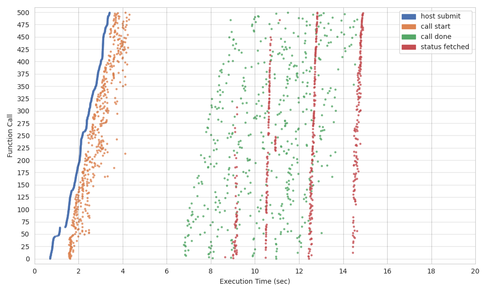
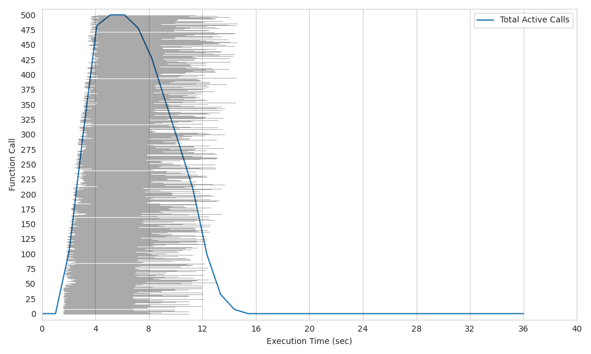

.. _futures-api-stats:

Execution stats
===============

Lithops provides built-in internal tools to supply the user with technical statistics of job execution.

Execution summary plots
-----------------------

The :code:`plot()` method from :code:`FunctionExecutor` creates a scatter plot and a histogram plot showing a summary of the tasks executed by a :code:`FunctionExecutor`. By default, lithops creates a :code:`plots/` directory in the working directory path containing both plots in PNG format. For more details refer to the `FunctionExecutor API reference <https://lithops-cloud.github.io/docs/source/api_futures.html>`_.

To get started, first install Lithops and the plotting dependencies with:

.. code-block:: bash

   python3 -m pip install lithops[plotting]

* **Scatter Plot**: the scatter plot shows a timeline on the horizontal axis where the stages of all invocations are arranged on the vertical axis.
    - :code:`host submit` indicates the time that the orchestrator process has invoked the function.
    - :code:`call start` indicates the timestamp at which the function starts its execution.
    - :code:`call done` indicates the timestamp at which the function has finished its execution.
    - :code:`status fetched` indicates the timestamp at which the orchestrator process has received the function completion signal.

* **Histogram Plot**: the histogram shows a timeline on the horizontal axis showing the execution time of the different functions arranged on the vertical axis. Each execution time of a function is shown in horizontal gray lines. In addition, the total number of functions running in parallel at each time is shown as a line graph.

The following example snipped was used to create the execution plots shown above:

.. code:: python

    import random
    import lithops
    import time

    def my_map_function(id, x):
        print("I'm activation number {}".format(id))
        time.sleep(random.randint(5, 10))  # Do some work...
        return x + 7

    fexec = lithops.FunctionExecutor()
    fexec.map(my_map_function, range(500))
    fexec.wait()
    fexec.plot()

Execution stats
---------------

The :code:`Future` and :code:`FutureList` objects contain a :code:`stats` attribute which is a dictionary where different statistics of a given lithops job are stored.
The user can obtain these statistics through the future object:

.. code:: python

    import lithops
    from pprint import pprint

    def my_function(x):
        return x + 7

    fexec = lithops.FunctionExecutor()
    future = fexec.call_async(my_function, 3)
    result = fexec.get_result(fs=future)
    pprint(future.stats)

.. code::

    {'func_data_size_bytes': 21,
     'func_module_size_bytes': 556,
     'func_result_size': 26.0,
     'host_data_upload_time': 0,
     'host_func_upload_time': 0.610441,
     'host_job_create_tstamp': 1647526900.752052,
     'host_job_created_time': 0.61281,
     'host_job_serialize_time': 0.001555,
     'host_result_done_tstamp': 1647526904.5000103,
     'host_result_query_count': 1,
     'host_status_done_tstamp': 1647526903.6858306,
     'host_status_query_count': 2,
     'host_submit_tstamp': 1647526901.3674674,
     'worker_cold_start': True,
     'worker_end_tstamp': 1647526902.397567,
     'worker_exec_time': 0.23604679,
     'worker_func_cpu_usage': [0.0, 25.0],
     'worker_func_cpu_user_time': 70566.78125,
     'worker_func_cpu_system_time': 16418.34375,
     'worker_func_end_tstamp': 1647526902.2985177,
     'worker_func_exec_time': 1.91e-06,
     'worker_func_recv_net_io': 5968,
     'worker_func_sent_net_io': 1223,
     'worker_func_start_tstamp': 1647526902.2985158,
     'worker_func_rss': 60678144,
     'worker_func_uss': 44838912,
     'worker_func_vms': 552267776,
     'worker_peak_memory_start': 88469504,
     'worker_peak_memory_end': 126469504,
     'worker_result_upload_time': 0.07001352,
     'worker_start_tstamp': 1647526902.1615202}

.. list-table::
   :widths: 30 70
   :header-rows: 1

   * - Stat
     - Description
   * - :code:`func_data_size_bytes`
     - Size in bytes of the input data processed by this function. That is, the object size of the input list item processed by this function. Note that if the function processes data obtained from object storage, this value does not include the size of that data, only those that have been serialized and sent from the host process to the function.
   * - :code:`func_module_size_bytes`
     - Size in bytes of the dependencies (function and modules) serialized and uploaded by the host process.
   * - :code:`func_result_size`
     - Size in bytes of the result object of the function that has been returned by the `return` statement. Note that if the function uploads the result to object storage and, for example, only returns the key of the object through the `return` statement, this parameter will indicate the size of the key and not the size of the actual result data.
   * - :code:`host_data_upload_time`
     - Total time taken by the host process to upload the input data to cloud object storage.
   * - :code:`host_func_upload_time`
     - Total time taken by the host process to upload the dependencies (function and serialized modules) to cloud object storage.
   * - :code:`host_job_create_tstamp`
     - Timestamp of the job creation, i.e. the initial time of the call to `call_async`, `map` or `map_reduce`.
   * - :code:`host_job_created_time`
     - Total time taken by the host process to create the job.
   * - :code:`host_job_serialize_time`
     - Total time taken by the host process to serialize the input data and dependencies (functions and modules).
   * - :code:`host_result_done_tstamp`
     - Timestamp of when host received the function result from cloud object storage.
   * - :code:`host_result_query_count`
     - Number of queries to the object storage to get the result object.
   * - :code:`host_status_done_tstamp`
     - Timestamp of when the host received the signal that the function has finished its execution.
   * - :code:`host_status_query_count`
     - Number of queries to the object storage to get the status object (synchronize the completion of the function).
   * - :code:`host_submit_tstamp`
     - Timestamp of function invocation.
   * - :code:`worker_cold_start`
     - Indicates whether it was a "warm" invocation (the container was already running) or "cold" (the container had to be deployed).
   * - :code:`worker_end_tstamp`
     - Timestamp in which the worker function had finished its execution.
   * - :code:`worker_exec_time`
     - Total execution time of the worker function (lithops wrapper + user defined funtion execution time).
   * - :code:`worker_func_cpu_usage`
     - Array of CPU usage percentages, with each element representing the average usage of each CPU core during user-defined function execution.
   * - :code:`worker_func_cpu_user_time`
     - CPU user time during the execution of the user-defined function.
   * - :code:`worker_func_cpu_system_time`
     - CPU system time during the execution of the user-defined function.
   * - :code:`worker_func_end_tstamp`
     - Timestamp of the end of execution of the user-defined function.
   * - :code:`worker_func_exec_time`
     - Total execution time of the user-defined function.
   * - :code:`worker_func_recv_net_io`
     - Network I/O bytes received during the execution of the user-defined function.
   * - :code:`worker_func_sent_net_io`
     - Network I/O bytes sent during the execution of the user-defined function.
   * - :code:`worker_func_start_tstamp`
     - Timestamp of the start of execution of the user-defined function.
   * - :code:`worker_func_rss`
     - Resident Set Size (RSS) in bytes, indicating the amount of physical memory occupied by the user-defined function during its execution.
   * - :code:`worker_func_uss`
     - Unique Set Size (USS) in bytes, representing the memory exclusively used by the function that is not shared with other processes.
   * - :code:`worker_func_vms`
     - Virtual Memory Size (VMS) in bytes used by the user-defined function. This metric quantifies the total virtual memory allocated.
   * - :code:`worker_result_upload_time`
     - Total time taken for the function to upload the result to cloud object storage.
   * - :code:`worker_start_tstamp`
     - Timestamp of the start of the worker function.
   * - :code:`worker_peak_memory_start`
     - Peak memory usage in bytes before executing the function.
   * - :code:`worker_peak_memory_end`
     - Peak memory usage in bytes after executing the function.

