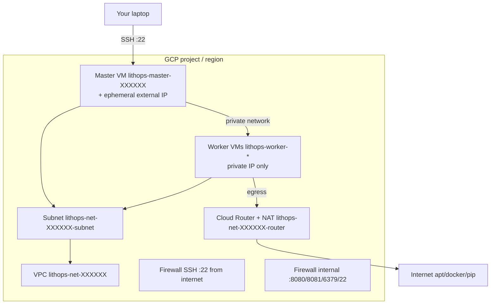

# Google Compute Engine (GCE)

Lithops includes a standalone backend named `gcp_compute_engie` for running jobs on Google Compute Engine virtual machines.

This backend supports:

- **consume mode**: use an existing VM instance.
- **create mode**: create the network resources and master/worker VMs on demand.
- **reuse mode**: keep and reuse workers between executions, creating only the missing delta.

> **Note**
> The backend key is intentionally `gcp_compute_engie` to match the current Lithops backend module name.

## Installation

Install Google Cloud dependencies:

```bash
python3 -m pip install lithops[gcp]
```

## VM setup troubleshooting

If master/worker installation fails with ``Cannot uninstall typing_extensions`` (or similar
``RECORD file not found`` / ``installed by debian`` errors), pip is conflicting with Ubuntu
system packages. On the VM, run:

```bash
sudo PIP_BREAK_SYSTEM_PACKAGES=1 pip3 install --ignore-installed -U pip
sudo PIP_BREAK_SYSTEM_PACKAGES=1 pip3 install --ignore-installed flask gevent 'lithops[gcp,redis]'
sudo systemctl restart lithops-master
```

New installs use ``--ignore-installed`` in the Lithops setup script to avoid this issue.

## Required IAM/API setup

### Enable the Compute Engine API

```bash
gcloud services enable compute.googleapis.com --project <PROJECT_ID>
```

Replace `<PROJECT_ID>` with your GCP project. API changes can take a few minutes to propagate.

### Grant IAM to the Lithops service account

`create` and `reuse` modes create VPC networks, subnets, firewalls, and VMs. The service account in `gcp.credentials_path` needs Compute Engine permissions.

If the API is enabled but you still see **403** with a message like `Required 'compute.networks.create' permission`, that is an **IAM** issue, not API propagation.

Grant **Compute Admin** on the project (adjust member if your service account email differs):

```bash
gcloud projects add-iam-policy-binding <PROJECT_ID> \
  --member="serviceAccount:<SERVICE_ACCOUNT_EMAIL>" \
  --role="roles/compute.admin"
```

Example for `lithops-executor@lithops-dev.iam.gserviceaccount.com`:

```bash
gcloud projects add-iam-policy-binding lithops-dev \
  --member="serviceAccount:lithops-executor@lithops-dev.iam.gserviceaccount.com" \
  --role="roles/compute.admin"
```

### GCS access from master and worker VMs

Your laptop uses the JSON key in `gcp.credentials_path`. **VMs do not copy that file**; they use the [GCE metadata service](https://cloud.google.com/compute/docs/access/service-accounts) and need a **service account attached at boot**.

Lithops attaches the account from `gcp.credentials_path` (`client_email` in the JSON) to every master and worker it creates. You can override with:

```yaml
gcp_compute_engie:
  service_account: lithops-executor@lithops-dev.iam.gserviceaccount.com
```

That service account also needs permission to use **Google Cloud Storage** (runtime data, job payloads). **Run this yourself** (replace project and email if yours differ):

```bash
gcloud projects add-iam-policy-binding lithops-dev \
  --member="serviceAccount:lithops-executor@lithops-dev.iam.gserviceaccount.com" \
  --role="roles/storage.objectAdmin"
```

To confirm the role is present:

```bash
gcloud projects get-iam-policy lithops-dev \
  --flatten="bindings[].members" \
  --filter="bindings.members:lithops-executor@lithops-dev.iam.gserviceaccount.com" \
  --format="table(bindings.role)"
```

You should see at least `roles/compute.admin` and `roles/storage.objectAdmin`.

### After updating Lithops (service account on VMs)

1. Ensure both IAM bindings above exist (manual, one-time).
2. Recreate VMs so they boot with the service account attached:

```bash
lithops clean -a -b gcp_compute_engie -s gcp_storage
lithops hello -b gcp_compute_engie -s gcp_storage
```

If you see `metadata ... service-accounts/default ... 404`, the VM has **no service account attached** (typical for VMs created before this backend change). Use `clean -a` + `hello`, or in the GCP console edit the instance → **Service account** → select your Lithops executor SA → save and restart the VM.

For **consume** mode (existing VM only), narrower roles may suffice if the VM and network already exist; you still need SSH access to the instance and a service account on that VM with GCS permissions.

## List VM images

List Ubuntu LTS families (latest image per family) and custom images in your project whose name contains `lithops`:

```bash
lithops image list -b gcp_compute_engie
```

Use the **Image ID** column value as `source_image` in your config (for example `projects/ubuntu-os-cloud/global/images/family/ubuntu-2404-lts-amd64`).

## Networking and internet access

In `create` / `reuse` mode Lithops provisions a custom VPC, subnet, firewalls, and **Cloud NAT** (outbound internet for private worker VMs). This matches the pattern used on **IBM VPC** (public gateway on the subnet) rather than giving every worker its own public IP.

| VM | External IP | Outbound internet | SSH from your laptop |
|---|---|---|---|
| Master | Yes (ephemeral) | Direct | Yes (public IP) |
| Workers | No (private IP only) | Via Cloud NAT | No (master reaches workers on the private network) |

**AWS EC2** in Lithops assigns a public IP to every instance in the public subnet (`AssociatePublicIpAddress`), so workers reach apt/Docker without NAT. On GCP, a public IP per short-lived worker is optional but usually more expensive than one Cloud NAT gateway.

Set `worker_public_ip: true` in `gcp_compute_engie` if you prefer the AWS-style model (one ephemeral external IP per worker) instead of Cloud NAT.

If you created a Lithops VPC **before** Cloud NAT support was added, run `lithops hello` once (init will add NAT to the existing subnet) or `lithops clean -a` and let Lithops recreate the network.

### Resources Lithops creates (`create` / `reuse`)

All of these are shared by the **master** and **workers** (same subnet). The master is just another VM with `public=True` (ephemeral external IP for SSH from your laptop).

| Resource | Name pattern | Purpose |
|---|---|---|
| VPC network | `lithops-net-XXXXXX` | Custom mode VPC |
| Regional subnet | `lithops-net-XXXXXX-subnet` | Master + workers NICs (`10.0.0.0/24` by default) |
| Firewall (SSH) | `lithops-net-XXXXXX-fw` | TCP/22 from `0.0.0.0/0` |
| Firewall (internal) | `lithops-net-XXXXXX-internal-fw` | TCP 8080, 8081, 6379, 22 inside VPC CIDR |
| Cloud Router + NAT | `lithops-net-XXXXXX-router` | Outbound internet for private workers |
| Master VM | `lithops-master-XXXXXX` | Redis, Lithops master service, SSH entry point |
| Worker VMs | `lithops-worker-<id>` | Job execution (created per run) |
| Boot disks | auto-deleted with VM | `autoDelete: true` on instance disks |
| Master external IP | ephemeral | Released when the master VM is deleted |

**Local (not in GCP):** cache file `~/.lithops/cache/gcp_compute_engie/<project>_<region>_vpc_data`, optional Lithops-generated SSH key, `{master}-id_rsa.pub` for worker cloud-init.

### `lithops clean` vs `lithops clean -a`

| Command | VMs | VPC / subnet / firewalls / NAT | Cache + Lithops SSH key |
|---|---|---|---|
| `lithops clean` | Workers only | Kept | Kept |
| `lithops clean -a` | Master + workers | Deleted (reverse order: firewalls → router → subnet → network) | Removed |

If you set `network_name` in config (bring your own VPC), Lithops does **not** create or delete network resources (`vpc_data_type: provided`).

## Create and reuse modes

In `create` mode, Lithops automatically provisions VPC/network resources plus worker VMs during execution and dismantles workers afterward.  
In `reuse` mode, Lithops reuses existing workers and only creates additional workers when needed.

### Configuration

```yaml
lithops:
  backend: gcp_compute_engie
  mode: standalone

gcp:
  credentials_path: <FULL_PATH_TO_SERVICE_ACCOUNT_JSON>

gcp_compute_engie:
  project_name: <GCP_PROJECT_ID>
  zone: <ZONE>            # e.g. us-east1-b
  region: <REGION>        # optional, derived from zone if omitted
  exec_mode: reuse        # create | reuse | consume
  worker_instance_type: e2-standard-2
  master_instance_type: e2-small
```

### Summary of configuration keys (create/reuse)

|Group|Key|Default|Mandatory|Additional info|
|---|---|---|---|---|
|gcp_compute_engie|project_name||yes|GCP project ID |
|gcp_compute_engie|zone||yes|Compute Engine zone, for example `us-east1-b` |
|gcp_compute_engie|region|derived from zone|no|Region used for subnet creation |
|gcp_compute_engie|credentials_path||no|Service account JSON path. If omitted, ADC is used. Also used to pick the SA attached to master/worker VMs |
|gcp_compute_engie|service_account||no|Service account email for VMs (GCS via metadata). Default: `client_email` from `credentials_path` |
|gcp_compute_engie|master_instance_type|e2-small|no|Master VM machine type |
|gcp_compute_engie|worker_instance_type|e2-standard-2|no|Worker VM machine type |
|gcp_compute_engie|source_image|ubuntu-2404-lts-amd64 family (Python 3.12)|no|Boot image reference |
|gcp_compute_engie|boot_disk_size|50|no|Boot disk size (GB) |
|gcp_compute_engie|boot_disk_type|pd-standard|no|Boot disk type |
|gcp_compute_engie|network_cidr|10.0.0.0/16|no|CIDR for created network |
|gcp_compute_engie|subnet_cidr|10.0.0.0/24|no|CIDR for created subnet |
|gcp_compute_engie|worker_public_ip|False|no|If `true`, assign an external IP to each worker (AWS-style). Default uses Cloud NAT instead |
|gcp_compute_engie|request_spot_instances|False|no|Use Spot VMs for workers |
|gcp_compute_engie|max_workers|100|no|Max number of workers per `FunctionExecutor()` |
|gcp_compute_engie|worker_processes|AUTO|no|Worker process count |
|gcp_compute_engie|exec_mode|reuse|no|One of `consume`, `create`, `reuse` |
|gcp_compute_engie|extra_apt_packages|[]|no|Extra Debian/Ubuntu packages installed on master/worker VMs during setup. List or space-separated string. See [VM installation extras](../execution_modes.rst#vm-installation-extras) |
|gcp_compute_engie|extra_python_packages|[]|no|Extra pip packages installed on master/worker VMs after Lithops. List or space-separated string. See [VM installation extras](../execution_modes.rst#vm-installation-extras) |

## Consume mode

In consume mode, Lithops uses an existing VM and does not provision network/worker resources.

### Configuration

```yaml
lithops:
  backend: gcp_compute_engie
  mode: standalone

gcp:
  credentials_path: <FULL_PATH_TO_SERVICE_ACCOUNT_JSON>

gcp_compute_engie:
  exec_mode: consume
  project_name: <GCP_PROJECT_ID>
  zone: <ZONE>
  instance_name: <EXISTING_VM_NAME>
  ssh_username: ubuntu
  ssh_key_filename: ~/.ssh/id_rsa
```

### Summary of configuration keys (consume)

|Group|Key|Default|Mandatory|Additional info|
|---|---|---|---|---|
|gcp_compute_engie|project_name||yes|GCP project ID |
|gcp_compute_engie|zone||yes|Compute Engine zone |
|gcp_compute_engie|instance_name||yes|Existing VM instance name |
|gcp_compute_engie|ssh_username|ubuntu|no|SSH user for the VM |
|gcp_compute_engie|ssh_key_filename|~/.ssh/id_rsa|no|Path to SSH private key |
|gcp_compute_engie|worker_processes|AUTO|no|Worker process count |

## Test Lithops

```bash
lithops hello -b gcp_compute_engie -s gcp_storage
```

## Viewing execution logs

```bash
lithops logs poll
```

## Architecture diagram

The master and workers share one Lithops VPC and subnet. The master has an ephemeral external IP for SSH from your laptop; workers use private IPs and reach the internet through Cloud NAT.


