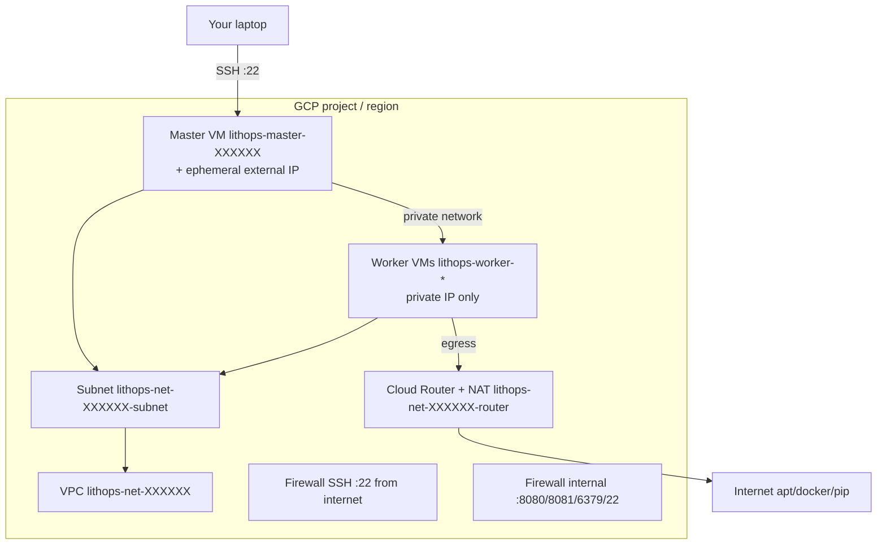

# Google Compute Engine (GCE)

The GCP Compute Engine backend of Lithops can provide a serverless user experience on top of GCE where Lithops creates new Virtual Machines (VMs) dynamically at runtime and scales Lithops jobs against them (create and reuse modes). Alternatively Lithops can start and stop an existing VM instance (consume mode).

The backend key is `gcp_compute_engine` (matches the Lithops module name).

## Choose an operating system image for the VM

Any VM needs an operating system image. By default Lithops uses Ubuntu 24.04 (`projects/ubuntu-os-cloud/global/images/family/ubuntu-2404-lts-amd64`). Lithops installs required dependencies on the VM on first use (this can take a few minutes).

For faster startups, build a pre-configured custom image (see [runtime/gcp_compute_engine](https://github.com/lithops-cloud/lithops/tree/master/runtime/gcp_compute_engine)):

```bash
lithops image build -b gcp_compute_engine
```

This creates `lithops-ubuntu-2404-lts-amd64-server` in your project; Lithops uses it automatically when present.

To list available images:

```bash
lithops image list -b gcp_compute_engine
```

Use the **Image ID** column as `source_image` in your config when using a custom image name.

## Installation

1. Install GCP backend dependencies:

```bash
python3 -m pip install lithops[gcp]
```

## Create and reuse modes

In the `create` mode, Lithops automatically creates new worker VM instances at runtime, runs the job on them, and deletes the workers when the job completes (unless configured otherwise).

In the `reuse` mode, Lithops keeps the master and worker VMs stopped between jobs and starts them again when needed. It reuses running workers when possible and only creates new workers if necessary.

### Configuration

1. Enable the Compute Engine API:

```bash
gcloud services enable compute.googleapis.com --project <PROJECT_ID>
```

2. Create a service account (or use an existing one) and grant these roles on the project:

```bash
gcloud projects add-iam-policy-binding <PROJECT_ID> \
  --member="serviceAccount:<SERVICE_ACCOUNT_EMAIL>" \
  --role="roles/compute.admin"

gcloud projects add-iam-policy-binding <PROJECT_ID> \
  --member="serviceAccount:<SERVICE_ACCOUNT_EMAIL>" \
  --role="roles/storage.objectAdmin"
```

3. Set the Lithops config file:

```yaml
lithops:
  backend: gcp_compute_engine

gcp:
  credentials_path: <FULL_PATH_TO_SERVICE_ACCOUNT_JSON>

gcp_compute_engine:
  project_name: <GCP_PROJECT_ID>
  zone: <ZONE>
  exec_mode: reuse
```

Lithops attaches the service account from `credentials_path` to master and worker VMs so they can access GCS via the metadata service. You can set `service_account: <EMAIL>` explicitly if needed.

### Summary of configuration keys for GCP

|Group|Key|Default|Mandatory|Additional info|
|---|---|---|---|---|
|gcp | credentials_path | |no | Service account JSON used by Lithops on your machine and to select the VM service account |
|gcp | region | |no | GCP region. Derived from `zone` if omitted |

### GCE - Create and Reuse Modes

|Group|Key|Default|Mandatory|Additional info|
|---|---|---|---|---|
|gcp_compute_engine | project_name | |yes | GCP project ID |
|gcp_compute_engine | zone | |yes | Compute Engine zone, for example `us-east1-b` |
|gcp_compute_engine | region | derived from zone |no | Region used for subnet and NAT |
|gcp_compute_engine | service_account | |no | Service account email attached to VMs. Default: `client_email` from `credentials_path` |
|gcp_compute_engine | network_name | |no | Existing VPC name. If not provided, Lithops creates a new network |
|gcp_compute_engine | subnet_name | |no | Existing subnet name when using a custom VPC |
|gcp_compute_engine | source_image | ubuntu-2404-lts-amd64 |no | Boot image reference |
|gcp_compute_engine | master_instance_type | e2-small |no | Master VM machine type |
|gcp_compute_engine | worker_instance_type | e2-standard-2 |no | Worker VM machine type |
|gcp_compute_engine | ssh_username | ubuntu |no | Username to access the VM |
|gcp_compute_engine | ssh_password | |no | Password for worker VMs. If not provided, it is created randomly |
|gcp_compute_engine | ssh_key_filename | |no | SSH private key for the master VM. If not provided, Lithops creates `~/.ssh/lithops-key-<id>.gcp_ce.id_rsa` |
|gcp_compute_engine | request_spot_instances | False |no | Use Spot VMs for workers |
|gcp_compute_engine | delete_on_dismantle | True |no | Delete worker VMs when stopped. Master VM is never deleted when stopped |
|gcp_compute_engine | max_workers | 100 |no | Max number of workers per `FunctionExecutor()` |
|gcp_compute_engine | worker_processes | AUTO |no | Parallel Lithops processes per worker. Default: CPUs of `worker_instance_type` |
|gcp_compute_engine | runtime | python3 |no | Runtime name. Default: python3 on the VM |
|gcp_compute_engine | auto_dismantle | True |no | If False, VMs are not stopped automatically |
|gcp_compute_engine | soft_dismantle_timeout | 300 |no | Seconds to stop the VM after a job **completed** |
|gcp_compute_engine | hard_dismantle_timeout | 3600 |no | Seconds to stop the VM after a job **started** |
|gcp_compute_engine | exec_mode | reuse |no | One of: **consume**, **create** or **reuse** |
|gcp_compute_engine | extra_apt_packages | [] |no | Extra apt packages on master/worker VMs during setup |
|gcp_compute_engine | extra_python_packages | [] |no | Extra pip packages on master/worker VMs after Lithops |

## Consume mode

In this mode, Lithops uses an existing VM. The VM must be reachable by SSH and have a service account with GCS access.

### Configuration

```yaml
lithops:
  backend: gcp_compute_engine

gcp:
  credentials_path: <FULL_PATH_TO_SERVICE_ACCOUNT_JSON>

gcp_compute_engine:
  exec_mode: consume
  project_name: <GCP_PROJECT_ID>
  zone: <ZONE>
  instance_name: <EXISTING_VM_NAME>
```

### Summary of configuration keys for the consume mode

|Group|Key|Default|Mandatory|Additional info|
|---|---|---|---|---|
|gcp_compute_engine | instance_name | |yes | Existing VM instance name |
|gcp_compute_engine | project_name | |yes | GCP project ID |
|gcp_compute_engine | zone | |yes | Compute Engine zone |
|gcp_compute_engine | ssh_username | ubuntu |no | Username to access the VM |
|gcp_compute_engine | ssh_key_filename | |no | Path to the SSH private key. If not provided, Lithops creates `~/.ssh/lithops-key-<id>.gcp_ce.id_rsa` |
|gcp_compute_engine | worker_processes | AUTO |no | Parallel Lithops processes per worker |

## Test Lithops

Once you have your compute and storage backends configured, you can run a Hello World function with:

```bash
lithops hello -b gcp_compute_engine -s gcp_storage
```

## Viewing the execution logs

You can view the function execution logs on your local machine using the Lithops client:

```bash
lithops logs poll
```

## VM Management

Lithops for GCE follows a master-worker architecture (1:N).

All VMs, including the master, are automatically stopped after a configurable timeout (see hard/soft dismantle timeouts). Stopped master and worker VMs are started again on the next job in reuse mode.

You can open an SSH session to the master VM with:

```bash
lithops attach -b gcp_compute_engine
```

The master and worker VMs store Lithops service logs in `/tmp/lithops-root/*-service.log`.

To list available workers:

```bash
lithops worker list -b gcp_compute_engine
```

To list submitted jobs:

```bash
lithops job list -b gcp_compute_engine
```

To delete workers only:

```bash
lithops clean -b gcp_compute_engine -s gcp_storage
```

To delete workers, the master VM, and Lithops-created network resources:

```bash
lithops clean -b gcp_compute_engine -s gcp_storage --all
```

## Architecture diagram


