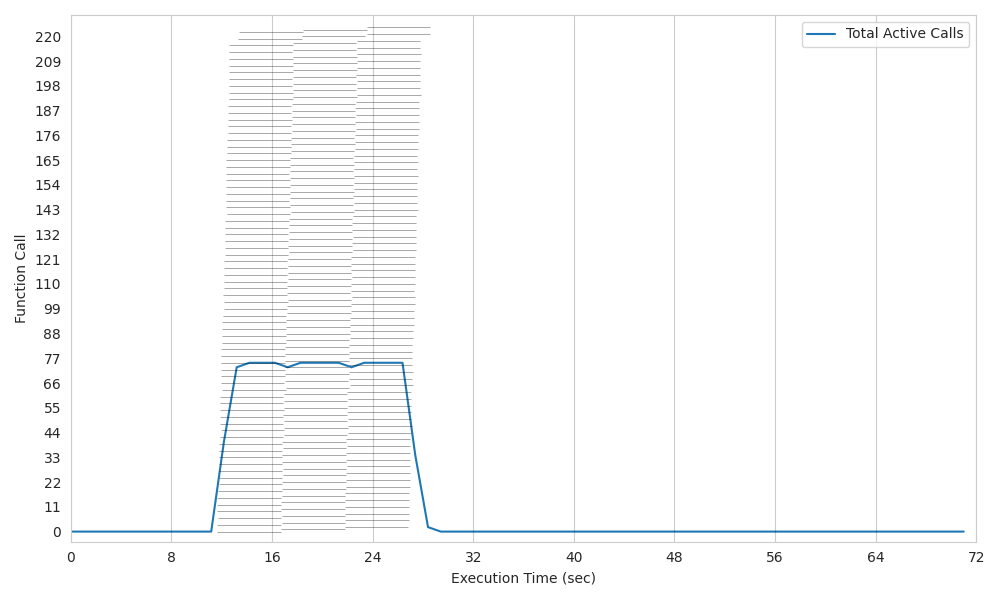
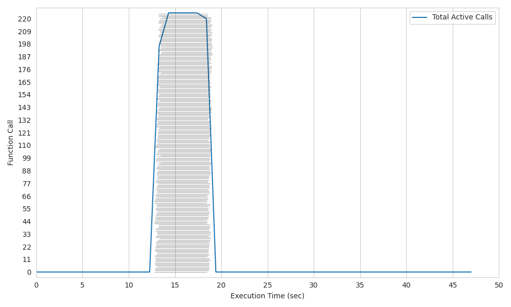
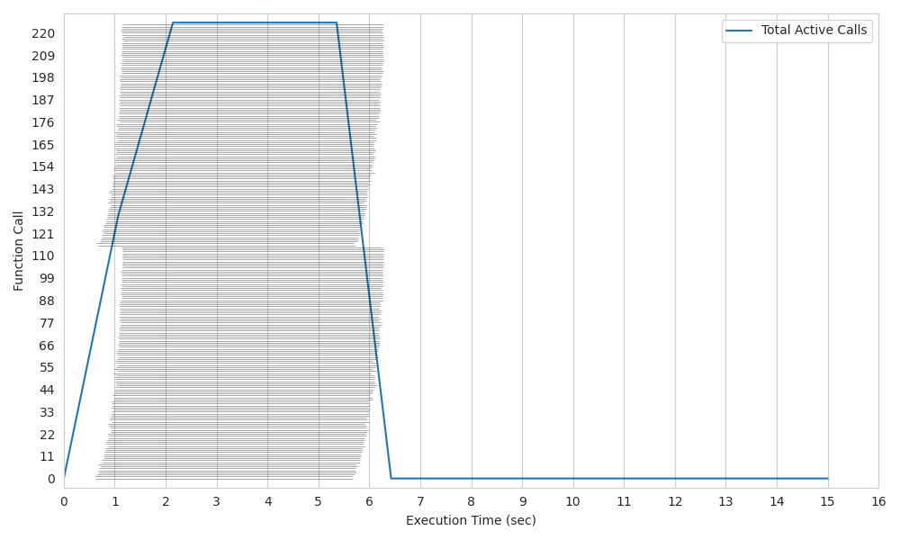

# Kubernetes RabbitMQ (batch/job)

**Lithops for Kubernetes RabbitMQ** is a **new experimental backend** that harnesses the capabilities of RabbitMQ to launch **group invocations** more efficiently. It introduces the utilization of pods in **warm start**, enhances the allocation of resources to the pods, and brings about other significant improvements.

All of these changes are **ideal** for pipelines where launching **hundreds of parallel tasks as quickly as possible** is a critical requirement.

### Changes of K8s RabbitMQ

* **Utilization of RabbitMQ:** Within this architecture, RabbitMQ is employed to launch group invocations in a single call, avoiding the need for multiple calls for each function execution. Additionally, it enables data exchange between the client and running pods, bypassing the Storage Backend as an intermediary. This accelerates and streamlines communication significantly.

* **Warm Start Capability:** Unlike K8s, Lithops K8s RabbitMQ introduces the ability to perform warm starts. This means that previously pods still listening to RabbitMQ to launch a new task, further reducing execution time to almost 0.

* **Improved Cold Start Time:** Lithops K8s RabbitMQ offers a significant enhancement in cold start time, effectively reducing the delay before your functions start executing.

* **CPU Assignment:** In this backend, CPU assignment is employed by allocating identifiers to each CPU. This approach facilitates more effective resource management within our cluster, enabling the creation of pods that match the entire capacity of a machine and allowing the launch of precisely the number of tasks that can run concurrently.

This architecture also comes with certain drawbacks, such as the limitation of launching different simultaneous clients due to its single-tenancy nature. Additionally, the granularity is currently defined by the number of CPUs available on the machine.

## Configuration

1. Edit your Lithops config and add the following keys:

```yaml
  lithops:
      backend : k8s

  k8s:
    ....
    docker_server       : docker.io
    docker_user         : <Docker hub Username>
    docker_password     : <DOcker hub access TOEKN>
    ....
    rabbitmq_executor : True
```

2. Make sure you have a kubernetes cluster configuration file.
   - Option 1: You have the config file in `~/.kube/config`

   - Option 2: You have the config file in another location, and you exported the KUBECONFIG variable:
     ```bash
     export KUBECONFIG=<path-to-kube-config-file>
     ```

   - Option 3: You have the config file in another location, and you set the `kubecfg_path` var in the Lithops config:
     ```yaml
     k8s:
         kubecfg_path: <path-to-kube-config-file>
     ```

  3. For this version, a connection to [rabbitMQ](../monitoring.rst) is required.
  To enable Lithops to use this service, add the AMQP_URL key into the rabbitmq section in the configuration, for example:
  ```yaml
  rabbitmq:
      amqp_url: <AMQP_URL>  # amqp://
  ```
  In addition, you need to activate the monitoring service in the configuration (Lithops section):

  ```yaml
  lithops:
    monitoring: rabbitmq
  ```

## Comparison

In these graphs, we will compare the usage of the original K8s architecture with the RabbitMQ implementation.

All of these tests consist of running 225 functions on a 2-node cluster, each with 128 CPUs. The executed function involves a 5-second sleep.

In this scenario, it is evident that the cold start times are consistently reduced by a factor of **up to 7x**, and task execution times are improved by a factor of **2x** across all cases. This represents a significant enhancement for parallel function execution.

#### Plot 1: Kubernetes K8s original with granularity 1. 

*Elapsed time = 28 sec.*



#### Plot 2: Kubernetes K8s original with granularity 6. 

*Elapsed time = 17 sec.*



#### Plot 3: Kubernetes K8s RabbitMQ. 

*Elapsed time = 8 sec.*


#### Plot 4: Kubernetes K8s RabbitMQ with Warm Start. 

*Elapsed time = 6,5 sec.*



## Test Lithops

Once you have your compute and storage backends configured, you can run a hello world function with:

```bash
lithops hello -b k8s -s ibm_cos
```

## Viewing the execution logs

You can view the function executions logs in your local machine using the *lithops client*:

```bash
lithops logs poll
```