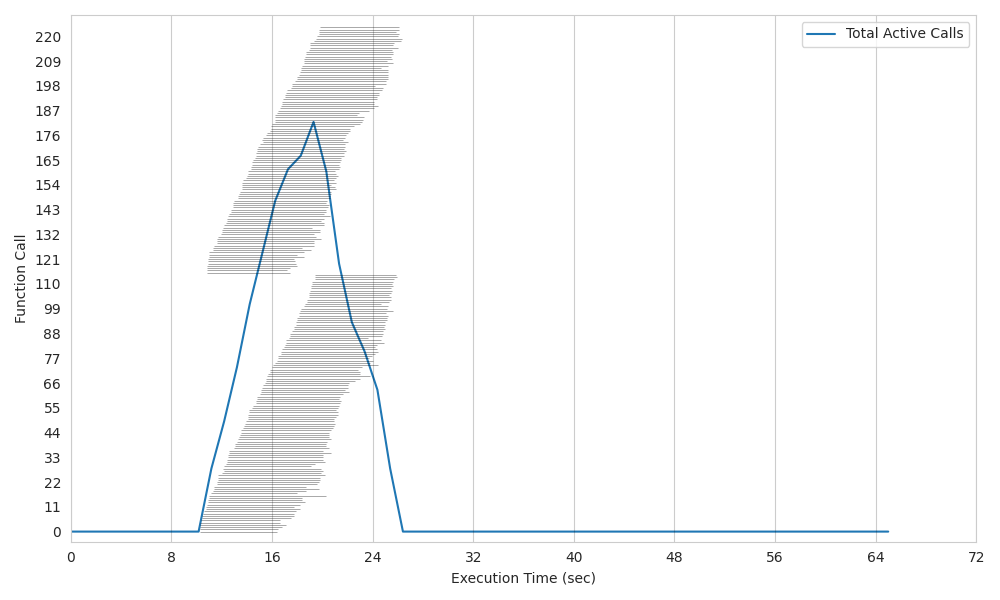
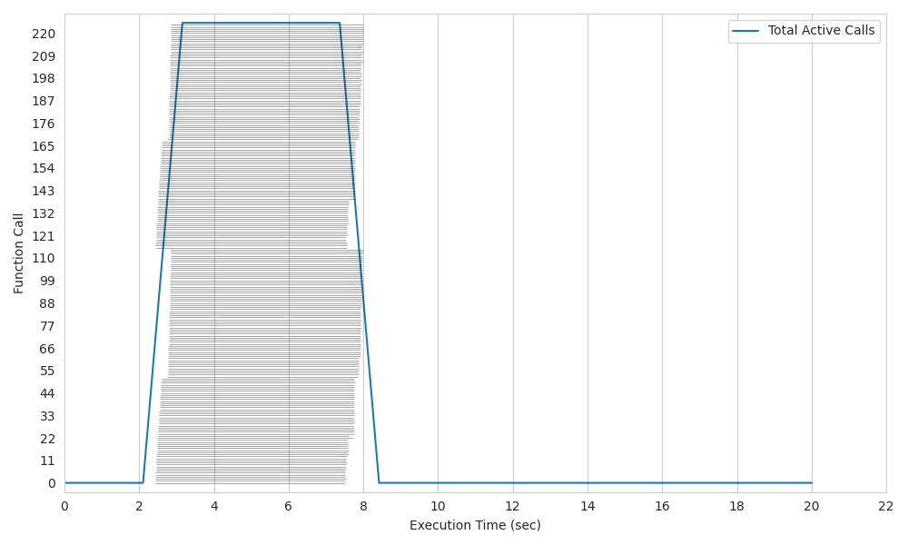
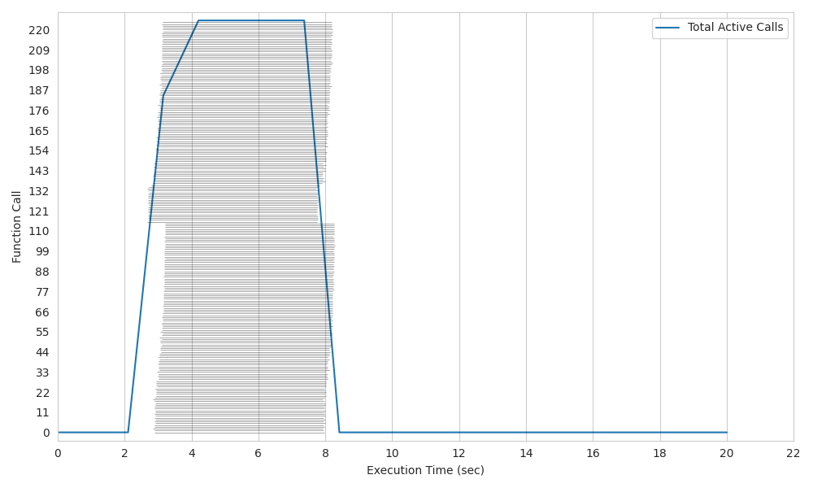
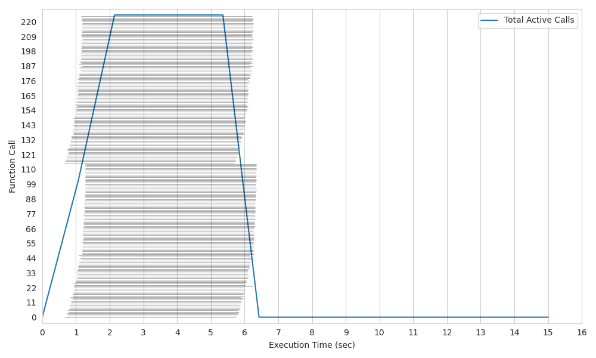

# Kubernetes RabbitMQ (batch/job)

**Lithops for Kubernetes RabbitMQ** is an **experimental k8s backend** designed to leverage the capabilities of RabbitMQ for more efficient execution of **group invocations**. It introduces the use of pods for **warm starts**, optimizes resource allocation, and offers various enhancements.

All of these changes are **ideal** for pipelines where launching **hundreds of parallel tasks as quickly as possible** is a critical requirement, in a fixed size heterogeneous cluster.

### Changes of K8s RabbitMQ

* **Utilization of RabbitMQ:** Within this architecture, RabbitMQ is employed to launch group invocations in a single call, avoiding the need for multiple calls for each function execution. Additionally, it enables data exchange between the client and running pods, bypassing the Storage Backend as an intermediary, which is slower. This accelerates and streamlines communication significantly.

* **Warm Start Capability:** Unlike K8s, Lithops K8s RabbitMQ introduces the ability to perform warm starts on the workers pods. This means that previous workers pods still listening to RabbitMQ to launch a new task, further reducing invocation time to almost 0.

* **Improved Invocation Time:** Lithops K8s RabbitMQ offers an **up x4** significant enhancement in cold start time, effectively reducing the delay before your functions start executing.

* **Resource Utilization:** In this backend, CPU assignment is employed by allocating identifiers to each CPU. This approach facilitates more effective resource management within our cluster, enabling the creation of pods that by default match the entire capacity of a machine (worker_processes) and allowing the launch of precisely the number of tasks that can run concurrently.

## Installation

1. Install kubernetes backend dependencies:

```bash
python3 -m pip install lithops[kubernetes]
```

## Configuration

1. Edit your Lithops config and add the following keys:

```yaml
  lithops:
      backend : k8s

  k8s:
    ....
    docker_server       : docker.io
    docker_user         : <Docker hub Username>
    docker_password     : <DOcker hub access TOEKN>
    ....
    rabbitmq_executor : True
```

2. Make sure you have a kubernetes cluster configuration file.
   - Option 1: You have the config file in `~/.kube/config`

   - Option 2: You have the config file in another location, and you exported the KUBECONFIG variable:
     ```bash
     export KUBECONFIG=<path-to-kube-config-file>
     ```

   - Option 3: You have the config file in another location, and you set the `kubecfg_path` var in the Lithops config:
     ```yaml
     k8s:
         kubecfg_path: <path-to-kube-config-file>
     ```

  3. For this version, a connection to [rabbitMQ](../monitoring.rst) is required.
  To enable Lithops to use this service, add the AMQP_URL key into the rabbitmq section in the configuration, for example:
  ```yaml
  rabbitmq:
      amqp_url: <AMQP_URL>  # amqp://
  ```
  In addition, you need to activate the monitoring service in the configuration (Lithops section):

  ```yaml
  lithops:
    monitoring: rabbitmq
  ```

## Comparison

In these graphs, we will compare the usage of the original K8s architecture with the RabbitMQ implementation.

All of these tests consist of running 225 functions on a 2-node cluster, each with 128 CPUs. The executed function involves a 5-second sleep.

In this scenario, it is evident that the invocation time is consistently reduced by a factor of **up to 5x** on cold start and **up to 7x** on warm start. This represents a significant enhancement for parallel function execution.

#### Plot 1: Kubernetes K8s original. 

*Elapsed time = 16,9 sec.*



#### Plot 2: Kubernetes K8s original with master on Warm Start. 

*Elapsed time = 8,1 sec.*



#### Plot 3: Kubernetes K8s RabbitMQ. 

*Elapsed time = 8 sec.*



#### Plot 4: Kubernetes K8s RabbitMQ with workers on Warm Start. 

*Elapsed time = 5,9 sec.*



## Summary of configuration keys for kubernetes:

|Group|Key|Default|Mandatory|Additional info|
|---|---|---|---|---|
|k8s | kubecfg_path | |no | Path to kubecfg file. Mandatory if config file not in `~/.kube/config` or KUBECONFIG env var not present|
|k8s | kubecfg_context |  |no | kubernetes context to use from your kubeconfig file. It will use the default active context if not provided |
|k8s | namespace | default |no | Kubernetes namespace to use for lithops execution |
|k8s | docker_server | docker.io |no | Container registry URL |
|k8s | docker_user | |no | Container registry user name |
|k8s | docker_password | |no | Container registry password/token. In case of Docker hub, login to your docker hub account and generate a new access token [here](https://hub.docker.com/settings/security)|
|k8s | rabbitmq_executor | False | yes | Alternative K8s backend accelerating parallel function execution (map) thanks to rabbitmq group calls and warm-state pods of higher granularity.|
|k8s | worker_processes |  |no | CPUs per pod. This enables pod granularity. Default gets all CPUs of the nodes. |
|k8s | runtime |  |no | Docker image name.|
|k8s | runtime_cpu | 1 |no | CPU limit. Default 1vCPU |
|k8s | runtime_memory | 512 |no | Memory limit in MB per pod. Default 512MB |

## Test Lithops

Once you have your compute and storage backends configured, you can run a hello world function with:

```bash
lithops hello -b k8s -s ibm_cos
```

## Viewing the execution logs

You can view the function executions logs in your local machine using the *lithops client*:

```bash
lithops logs poll
```