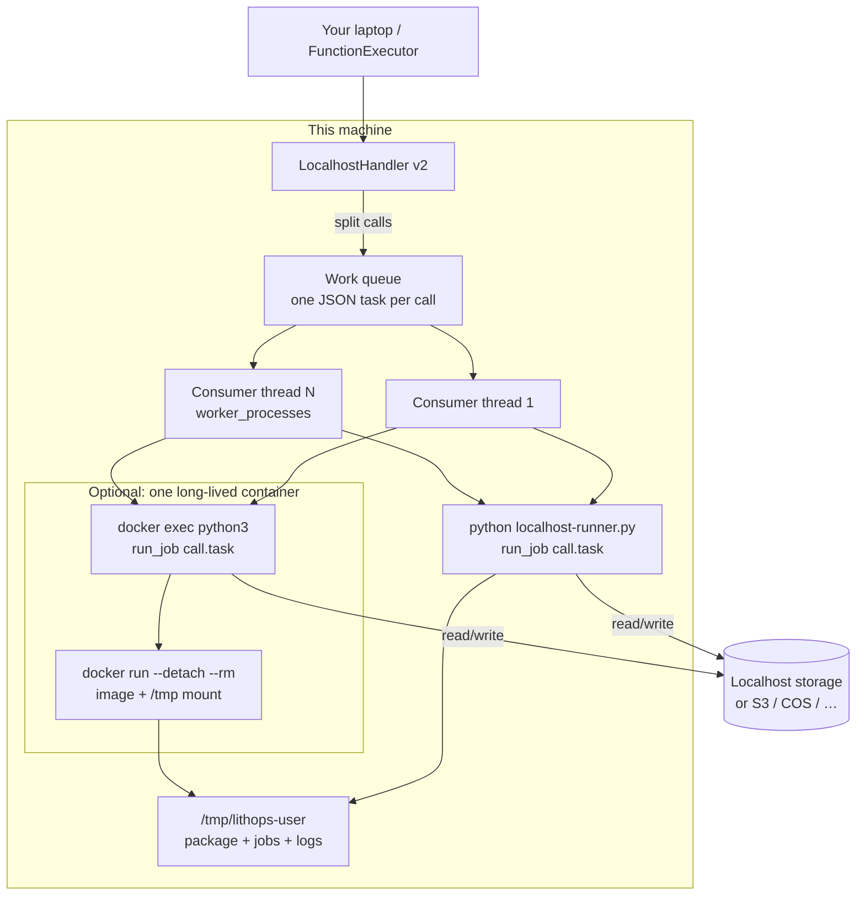
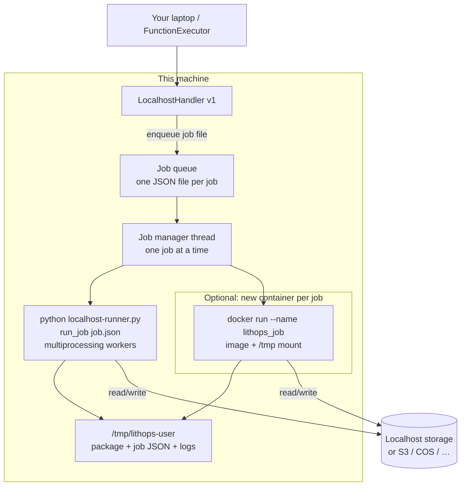

# Localhost

In localhost mode, Lithops uses your local CPUs to run functions in parallel. In this mode of execution it is not necessary to provide any kind of configuration or create a configuration file.

## Configuration

1. If you have a config file, edit it and add these keys:

```yaml
lithops:
    backend: localhost
    storage: localhost  # You can also set it to a public storage backend, such as aws_s3 or ibm_cos
```

## Execution Environments

The localhost backend can run functions both using the local ``python3`` interpreter, or using a ``container`` image. The environment is automatically chosen depending on whether or not you provided a Docker image as a runtime.

In both cases, you can view the executions logs in your local machine using the *lithops client*:

```bash
lithops logs poll
```

### Default Environment

By default, Lithops uses the local Python interpreter to run the functions. That is, for example, if you executed the main script with ``python3.12``, your functions will run with ``python3.12``. In this case, you must ensure that all the dependencies of your script are installed on your machine.

```python
# As we use the default FunctionExecutor(), backend must be set to localhost in config
fexec = lithops.FunctionExecutor()
```

or alternatively, you can force the Localhost executor with:

```python
# As we use/force the LocalhostExecutor(), backend does not need to be set to localhost in config
fexec = lithops.LocalhostExecutor()
```

### Container Environment

The Container environment runs the functions within a ``Docker container``. In this case you must [install the Docker CE version](https://docs.docker.com/get-docker/) on your machine. This environment is automatically activated when you provide a Docker image as a runtime. For example, by adding the following keys in the config:

```yaml
localhost:
    runtime: docker.io/lithopscloud/ibmcf-python-v312
```

or by using the ``runtime`` param in a function executor:

```python
# As we use the default FunctionExecutor(), the "backend" config parameter must be set to localhost in config
fexec = lithops.FunctionExecutor(runtime='docker.io/lithopscloud/ibmcf-python-v312')
```

```python
# As we use/force the LocalhostExecutor(), the "backend" config parameter does not need to be set to localhost in config
fexec = lithops.LocalhostExecutor(runtime='docker.io/lithopscloud/ibmcf-python-v312')
```

In this mode of execution, you can use any Docker image that contains all the required dependencies. For example, the IBM Cloud Functions and Knative runtimes are compatible with it.

## Implementation versions (v1 and v2)

There are two localhost implementations. **v2 is the default** (`localhost.version: 2`). Set `version: 1` only if you need the older job-at-a-time runner.

```yaml
localhost:
    version: 2   # default; use 1 for the alternative implementation
```

Both versions copy the Lithops package into `/tmp/lithops-<user>/` and can use either the **default** Python interpreter or a **container** image. They differ in how they schedule activations.

### How v2 works (default)

v2 splits a job into **one task per function activation**. A pool of `worker_processes` consumer threads (default: CPU count) pulls tasks from an in-memory work queue and runs them in parallel.

- **Default environment:** each task is a subprocess: `python localhost-runner.py run_job <call>.task`.
- **Container environment:** Lithops starts **one** long-lived container (`docker run --detach` with `/bin/bash`) and runs each task with `docker exec … python3 … run_job`. The host `/tmp` tree is bind-mounted into the container so job files and the Lithops package are shared.

### How v1 works

v1 treats a Lithops **job** as a single unit. The client writes one JSON job file with all call IDs. A job-manager thread runs jobs **one after another** and waits for each process to exit.

- **Default environment:** one subprocess runs the whole job: `python localhost-runner.py run_job <job>.json`. Parallelism is inside that process (`multiprocessing`, `worker_processes` workers).
- **Container environment:** each job starts a **new** container (`docker run --name lithops_<job_key>`). The container exits when the job finishes (`--rm`). There is no shared long-lived worker container.

### v1 vs v2

| | **v2 (default)** | **v1** |
|---|---|---|
| Scheduling unit | One activation (call) | One job (all calls together) |
| Parallelism | `worker_processes` consumer threads, each running a task | Job manager is serial; parallelism is inside the job process |
| Default runtime | One Python subprocess per call | One Python subprocess per job |
| Container runtime | One detached container for the executor; `docker exec` per call | New `docker run` per job |
| Job payload on disk | Per-call `.task` files under `/tmp/lithops-*/jobs/` | One `.json` job file under the storage prefix |
| When to use | Default; better overlap of independent activations | Compatibility with the older runner |

## Architecture diagram

Localhost never provisions cloud VMs. The client, job manager, workers, and (optional) Docker engine all run on **your machine**. Function data uses localhost storage under `/tmp/lithops-<user>/` unless you set `storage` to a remote backend.

### v2 (default)



### v1



## Summary of configuration keys for Localhost:

|Group|Key|Default|Mandatory|Additional info|
|---|---|---|---|---|
|localhost | runtime | python3 | no | By default it uses the `python3` interpreter. It can be a container image name |
|localhost | version | 2 | no | There are 2 different localhost implementations. Use '1' for using the alternative version |
|localhost | worker_processes | CPU_COUNT | no | Number of Lithops processes. This is used to parallelize function activations. By default it is set to the number of CPUs of your machine |

## Test Lithops

Once you have your compute and storage backends configured, you can run a Hello World function with:

```bash
lithops hello -b localhost -s localhost
```

## Viewing the execution logs

You can view the function executions logs in your local machine using the *lithops client*:

```bash
lithops logs poll
```

You can view the localhost runner logs in `/tmp/lithops-*/localhost-runner.log`