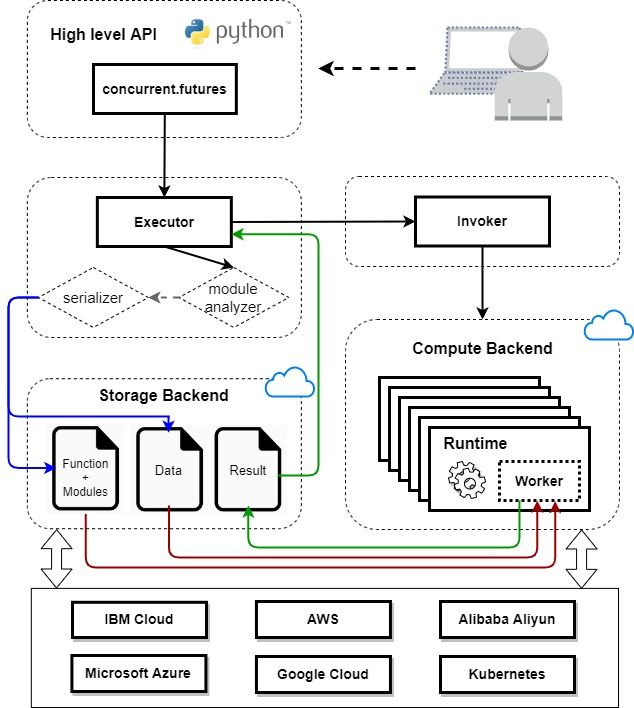
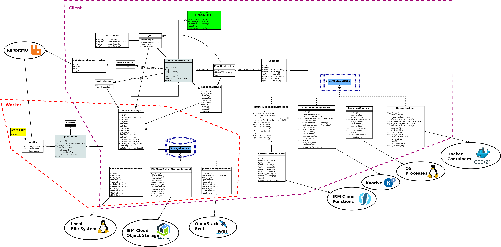

Architecture Design
===================

Lithops high-level architecture design:
---------------------------------------

   Lithops Architecture

Overview
--------

The chart below presents the main components of the architecture of Lithops. The components are largely divided into three sets:

* Components inside the dashed purple frame comprise the client code (running, e.g., on your laptop).
* Components inside the dashed orange frame comprise a Lithops worker. Each worker executes a "call", one unit of computation (e.g., processing one dataset record, or one object) within a larger map or reduce job of Lithops. Workers execute in the compute backend of choice, such as IBM Cloud Functions, Knative Serving, or even your local laptop.
* Outside both frames are various external facilities or services with which Lithops components interact. These external components are marked with ellipses, each one with its name and logo.

Note that the sets of Lithops components in both dashed frames are partially overlapping. In particular, the storage components are shared since Lithops’s main communication between the client and the workers relies on storage.

   Lithops Internal Design

The Lithops components themselves consist of key classes and modules. Both classes and modules are shown using UML class symbols, but class names start with uppercase letters and have an ``__init__()`` method, while modules do not.

The top-level client API module of Lithops, ``lithops.__init__``, is shown as a green module. It provides the API functions described in the documentation. Each of its functions creates an instance of ``FunctionExecutor``, which is the main class implementing Lithops logic, shown with a gray background.

A worker is deployed by the client code, but independently of the client - separate process, container, etc. Therefore, it requires a separate entry point to its logic, defined in the ``entry_point`` module, with a yellow background. As part of its execution, it eventually creates an instance of ``JobRunner``, which is the main class implementing the Lithops worker logic, also shown with a gray background.

The last components worth special mention are ``ComputeBackend`` and ``StorageBackend``. Each of these components has a light blue background and is surrounded by a compute or storage symbol, respectively, in dashed dark blue.

The ``ComputeBackend`` pseudo-interface represents a backend medium in which Lithops workers are deployed for executing computation - such as IBM Cloud Functions, Knative Serving, a Docker cloud, or your local laptop. A specific compute backend is chosen by using the specific API executor function.

The ``StorageBackend`` pseudo-interface represents a backend medium which Lithops uses for communicating between the client and the workers. When a client invokes a job, which is then passed to multiple workers for execution, the job data and specific call data is stored in this medium. Upon a worker completing a call, results are also stored in this medium. A specific storage backend is selected through Lithops configuration - IBM Cloud Object Storage, OpenStack Swift or local laptop’s file-system. All storage usage in Lithops adheres to object storage semantics, including objects, buckets, writing each object once, etc.

Computation flow
----------------

In Lithops, each map or reduce computation is executed as a separate compute *job*. This means that calling a ``FunctionExecutor.map()`` results in one job, and calling ``FunctionExecutor.map_reduce()`` results in two jobs, one of ``map()`` and one of ``reduce()``, executed one after the other.

As mentioned above, the ``FunctionExecutor`` class is responsible for orchestrating the computation in Lithops. One ``FunctionExecutor`` object is instantiated prior to any use of Lithops. Its initialization includes these important steps:

#. It sets up the workers (depending on the specific compute backend), such as constructing docker images, defining IBM Cloud Functions, etc. This step may not include actually creating the workers, as this may be done automatically by the backend on demand.
#. It defines a bucket in object storage (depending on the storage backend) in which each job will store job and call data (prior to computation) and results (when computation is complete).
#. It creates a ``FunctionInvoker`` object, which is responsible for executing a job as a set of independent per-worker calls.

Compute jobs are created in the functions of the ``job`` module (see chart above), invoked from the respective API method of ``FunctionExecutor``. Map jobs are created in ``create_map_job()`` and reduce jobs in ``create_reduce_job()``. The flow in both functions is quite similar. First, data is partitioned, with the intention that each partition be processed by one worker. For map jobs, this is done by invoking the ``create_partitions()`` function of the ``partitioner`` module, yielding a partition map.

For reduce jobs, Lithops currently supports two modes: reduce per object, where each object is processed by a reduce function, and global (default) reduce, where all data is processed by a single reduce function. Respectively, data is partitioned as either one partition per storage object, or one global partition with all data. This process yields a partition map similar to map jobs. Additionally, ``create_reduce_job()`` wraps the reduce function in a special wrapper function that forces waiting for data before the actual reduce function is invoked. This is because reduce jobs follow map jobs, so the output of the map jobs needs to finish before reduce can run.

Eventually, both ``create_map_job()`` and ``create_reduce_job()`` end up calling ``_create_job()``, which is the main flow of creating a job, described at a high level below:

#. A ``job_description`` record is defined for the job (and is eventually returned from all job creation functions).
#. The partition map and the data processing function (that processes a single partition in either map or reduce jobs) are each *pickled* (serialized) into a byte sequence.
#. The pickled partition map is stored in the object storage bucket, under the ``agg_data_key`` object.
#. The pickled processing function and its module dependencies are stored in the same bucket under the ``func_key`` object.

Once job creation is done and the ``job_description`` record for the new job is returned to the ``FunctionExecutor`` object, it proceeds to execute the job by calling the ``run()`` method of its ``FunctionInvoker`` instance. This triggers the following flow:

#. The job is executed as a set of independent *calls* (invocations) that are submitted to a ``ThreadPoolExecutor`` object (thread pool size is defined by configuration). This means call invocation is concurrent from the start.
#. Each call first executes an internal ``invoke()`` function defined inside ``FunctionInvoker.run()``, which builds a ``payload`` (parameter) as a single dictionary with all the data the call needs. The call data includes a copy of some of the ``job_description`` data as well as call-specific data such as:

   * ``call_id`` (integer ranging from 0 to ``total_calls - 1``)
   * ``data_byte_range`` — defines the specific partition for this call, as defined by the partitioner during job creation
   * ``output_key`` — specific storage object (in the bucket) for computation output
   * ``status_key`` — specific storage object (in the bucket) for computation logs

#. Invocation proceeds to ``Compute.invoke()``, which adds a retry mechanism for the current call, with random delays between retries (all configurable).
#. Invocation proceeds to ``ComputeBackend.invoke()``. Further execution depends on the compute backend:

   * On IBM Cloud Functions, ``invoke()`` is performed as a standard non-blocking action invocation, with the payload included as a single JSON parameter.
   * On Knative Serving, ``invoke()`` is performed as an HTTP POST request delivered over a connection that lasts for the entire time of the computation.
   * On localhost (your laptop), ``invoke()`` is performed by posting the call on a queue. A master process continuously pulls calls from the queue and dispatches them to processes from a pool of configurable size.
   * On a Docker cloud, ``invoke()`` is performed similarly to localhost above, except the processes in the pool controlled by the master further delegate execution to a Docker container they create.

#. When computation completes, each call commits the result to object storage in the configured bucket under the ``output_key`` object.
#. Each ``invoke()`` returns a ``ResponseFuture`` object, which is a future object to wait on for the computed result of each call.
#. A list of ``ResponseFuture`` objects returned by ``FunctionInvoker.run()`` is stored in the ``FunctionExecutor`` object and also returned by its respective method for the map [+reduce] job. Later calls to ``wait()`` or ``get_result()`` can be used to wait for job completion and retrieve the results, respectively.

Detecting Completion of Job
---------------------------

Completion of a computation job in Lithops is detected in one of two techniques: using RabbitMQ or polling object storage. The choice of either technique is configurable. A waiting part is implemented in ``FunctionExecutor.wait()``. A notification part is implemented in the worker code, depending on the chosen technique. This way, waiting in ``FunctionExecutor`` completes when all calls have notified completion, or a pre-configured timeout has expired.

**RabbitMQ**: A unique RabbitMQ topic is defined for each job, combining the executor id and job id. Each worker, once it completes a call, posts a notification message on that topic (code in ``function_handler()`` in the ``handler`` module, called from the ``entry_point`` module of the worker). The ``wait_rabbitmq()`` function from the ``wait_rabbitmq`` module, which is called from ``FunctionExecutor.wait()``, consumes a number of messages on that topic equal to ``total_calls`` and determines completion.

**Object Storage**: As explained above, each call persists its computation results in a specific object. Job completion is determined by ``FunctionExecutor.wait()`` invoking the ``wait_storage()`` function from the ``wait_storage`` module. This function repeatedly polls the executor's bucket (once per fixed, controllable period) for status objects of the subset of calls that have not yet completed. This allows control of resource usage and eventual detection of all calls.
