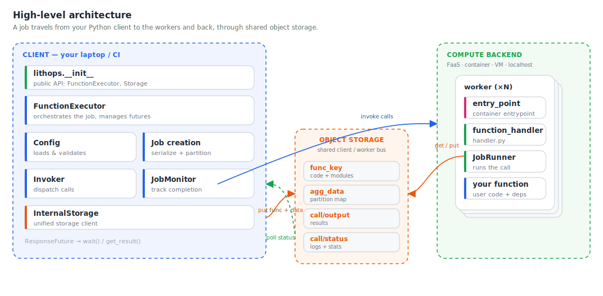
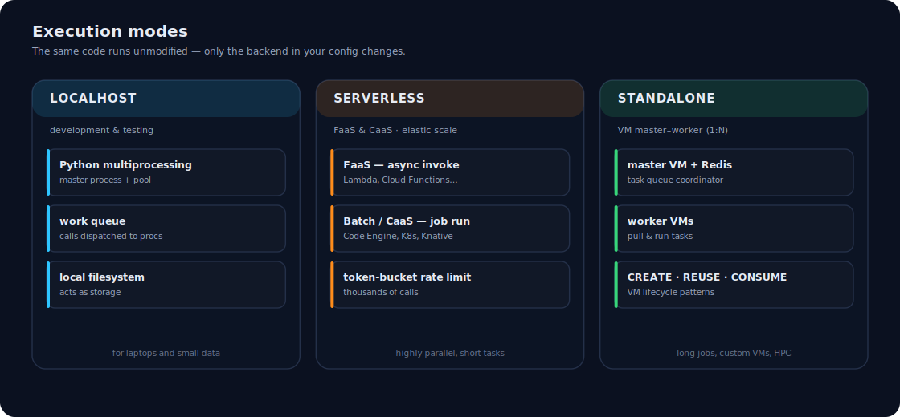
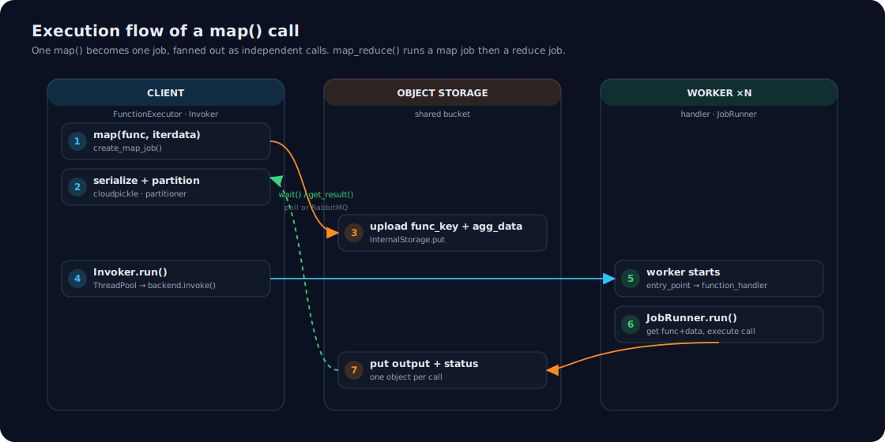

Architecture Design
===================

Lithops is a Python framework that runs **unmodified Python functions at scale** across
serverless platforms, containers, virtual machines, HPC clusters and your own laptop.
Its job is to hide the differences between all of those environments behind a single,
small API: you write plain Python, and Lithops takes care of packaging your code,
provisioning the workers, invoking them in parallel and streaming the results back.

This page describes how Lithops is built internally — its main components, the different
execution modes, and the exact path a computation follows from a ``map()`` call on the
client to thousands of parallel calls in the cloud and back.

High-level architecture
-----------------------

   The client, the compute backend and the shared object storage that connects them.

At the highest level, a Lithops deployment is made of three parts:

* **The client** — the process where you ``import lithops`` (your laptop, a notebook,
  a CI runner, a web service…). It builds jobs, serializes your code and data, invokes
  the workers and collects the results. All of the orchestration logic lives here.

* **The compute backend** — where the *workers* run. A worker executes a single *call*
  (one unit of work, such as one partition of your data). Depending on the backend, a
  worker is a serverless function invocation, a container task, a process on a VM, or a
  local process. Lithops can fan a job out to thousands of workers at once.

* **The object storage backend** — the shared *communication bus* between the client and
  the workers. Lithops does not open direct connections to workers: instead, the client
  writes the serialized function and data to storage, and each worker reads its input from
  storage and writes its output and status back. This decoupled, storage-centric design is
  what lets Lithops scale to massive fan-out and work identically across every backend.

Core components
---------------

The client-side logic is organized into a handful of components, most of which map
directly to a module or class in the ``lithops`` package:

.. list-table::
   :header-rows: 1
   :widths: 26 30 44

   * - Component
     - Location
     - Responsibility
   * - ``lithops.__init__``
     - ``lithops/__init__.py``
     - Public API surface (``FunctionExecutor``, ``Storage``, and helpers).
   * - ``FunctionExecutor``
     - ``lithops/executors.py``
     - Main entry point. Orchestrates job creation, invocation and monitoring, and
       returns futures. Specialized as ``LocalhostExecutor``, ``ServerlessExecutor``
       and ``StandaloneExecutor``.
   * - Configuration
     - ``lithops/config.py``
     - Loads and merges configuration from dicts, environment variables and YAML files,
       then validates the selected compute and storage backends.
   * - Job creation
     - ``lithops/job/job.py``, ``serialize.py``, ``partitioner.py``
     - Serializes the function with ``cloudpickle``, analyzes module dependencies and
       partitions the input data into per-call chunks.
   * - ``Invoker``
     - ``lithops/invokers.py``
     - Backend-specific dispatch. ``FaaSInvoker`` performs concurrent per-call
       invocations; ``BatchInvoker`` submits a single batch/job for many tasks.
   * - ``JobMonitor``
     - ``lithops/monitor.py``
     - Tracks completion through either ``StorageMonitor`` (polling) or
       ``RabbitmqMonitor`` (push notifications).
   * - ``InternalStorage``
     - ``lithops/storage/storage.py``
     - Uniform storage client used by both the client and the workers, backed by
       S3, IBM COS, Azure Blob, GCS, MinIO, Ceph, Redis and more.
   * - ``ResponseFuture``
     - ``lithops/future.py``
     - Future object that tracks the state of a single call and exposes its result.
   * - Worker
     - ``lithops/worker/`` (``handler.py``, ``jobrunner.py``)
     - Runs inside the compute backend: ``entry_point`` → ``function_handler()`` →
       ``JobRunner`` executes the call and reports back.

Execution modes
---------------

The same program can run in three different modes; only the backend you configure
changes. Lithops picks the matching executor and invoker automatically.

   The three execution modes: Localhost, Serverless and Standalone.

* **Localhost** — uses Python ``multiprocessing`` to run calls in a local pool of
  processes, with the local filesystem acting as the storage bus. Ideal for developing
  and testing before moving to the cloud.

* **Serverless** — deploys calls to managed **FaaS** platforms (AWS Lambda, Google Cloud
  Functions, Azure Functions, Aliyun, OpenWhisk) or to **container/batch**
  platforms (AWS Batch, Google Cloud Run, Azure Container Apps, IBM Code Engine,
  Kubernetes, Knative). This
  mode excels at highly parallel, short-lived tasks with elastic, on-demand scaling.

* **Standalone** — a master–worker architecture over virtual machines (AWS EC2, IBM VPC,
  Azure VMs, or a generic/on-prem VM). A master VM coordinates task distribution to worker
  VMs through a Redis queue. It supports three lifecycle patterns: **CREATE** (ephemeral
  workers per job), **REUSE** (a persistent worker pool shared across jobs) and **CONSUME**
  (run the whole job on a single existing VM). This mode suits long-running jobs, custom VM
  images and HPC environments.

Backend type classification
---------------------------

Internally, every compute backend is classified into one of three *types*, which
determines how calls are invoked and scaled:

* **FaaS** — direct, independent function invocations, rate-limited with a token bucket.
  Each call is one activation (e.g. AWS Lambda, Google Cloud Functions).
* **Batch** — a single job/definition submission manages many task executions
  (e.g. IBM Code Engine, Kubernetes Jobs, AWS Batch).
* **Standalone** — a master VM distributes tasks to worker VMs over Redis
  (e.g. IBM VPC, AWS EC2, Azure VMs).

Execution flow
--------------

In Lithops, each ``map`` or ``reduce`` computation is executed as a separate compute
*job*. Calling ``FunctionExecutor.map()`` produces one job, while
``FunctionExecutor.map_reduce()`` produces two jobs — a ``map`` job followed by a
``reduce`` job that waits for the map output before running.

   The path of a ``map()`` call: from job creation on the client, through object storage,
   to the workers and back.

**1. Executor initialization.**
A single ``FunctionExecutor`` is created before any use of Lithops. Its setup selects and
prepares the compute backend (for example, building or referencing a runtime image),
defines the object-storage bucket where jobs will keep their data, and creates the
``Invoker`` responsible for dispatching calls.

**2. Job creation.**
Map jobs are built by ``create_map_job()`` and reduce jobs by ``create_reduce_job()`` (in
the ``job`` module), both ending in the common ``_create_job()`` routine. Input data is
first partitioned — by the ``partitioner`` module for map jobs — so that each partition can
be processed by one worker. Reduce jobs support *per-object* reduce (one reduce per storage
object) and *global* reduce (a single reduce over all data), and wrap the reduce function so
it waits for the map results.

**3. Serialization and upload.**
The processing function and its detected module dependencies are serialized with
``cloudpickle``, and the partition map is pickled as well. Both are written to the
storage bucket:

* the pickled function and modules under the ``func_key`` object, and
* the pickled partition map under the ``agg_data`` object.

**4. Invocation.**
The executor calls ``Invoker.run()``, which submits the job's calls to a
``ThreadPoolExecutor`` so invocation is concurrent from the start. Each call builds a
``payload`` dictionary describing exactly what that worker must do, including:

* ``call_id`` — the index of the call, from ``0`` to ``total_calls - 1``;
* ``data_byte_range`` — the partition assigned to this call;
* ``output_key`` — the storage object where the result will be written;
* ``status_key`` — the storage object where logs and status will be written.

Invocation flows through a retry layer (with configurable random back-off) and then into
the backend-specific ``invoke()``: an async activation for FaaS, an HTTP request for
Knative, a queued task for localhost/standalone, and so on. Each invocation returns a
``ResponseFuture``.

**5. Worker execution.**
On the compute backend, a worker starts at its ``entry_point`` and calls
``function_handler()`` (``worker/handler.py``), which eventually creates a ``JobRunner``
(``worker/jobrunner.py``). The worker reads ``func_key`` and its data partition from
storage, executes your function on that partition, and writes the result to ``output_key``
and its status to ``status_key``.

**6. Monitoring and results.**
A list of ``ResponseFuture`` objects is returned to the client. Calling ``wait()`` or
``get_result()`` blocks until the job completes and then fetches the outputs from storage.

Detecting completion of a job
-----------------------------

``FunctionExecutor.wait()`` decides when a job is finished using one of two configurable
techniques, both implemented on top of the same storage-centric design:

* **Object storage polling** — the default. ``wait_storage`` periodically polls the
  bucket for the ``status`` objects of the calls that have not completed yet. The polling
  period is configurable, which lets you trade responsiveness against request volume.

* **RabbitMQ** — a lower-latency, push-based option. A unique topic is derived from the
  executor and job ids; each worker publishes a message when its call finishes, and the
  client consumes exactly ``total_calls`` messages to detect completion.

In both cases, ``wait()`` returns once every call has reported completion or a configured
timeout has elapsed.
